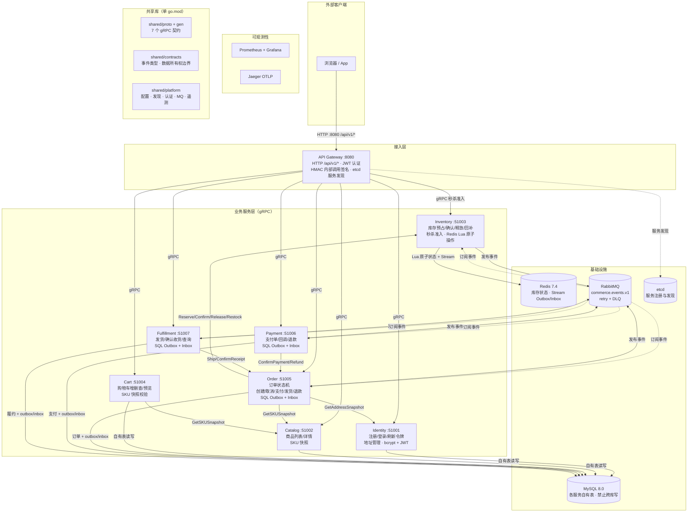
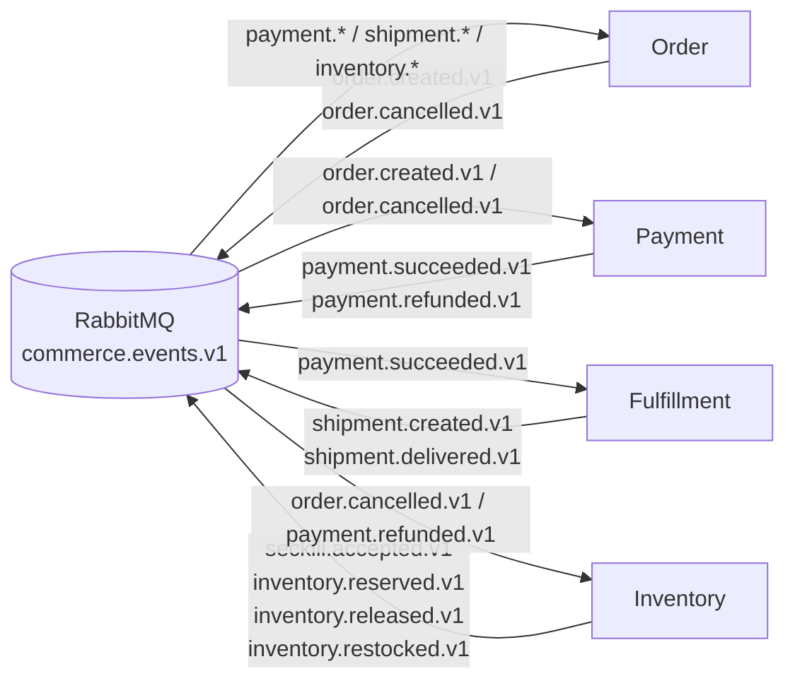
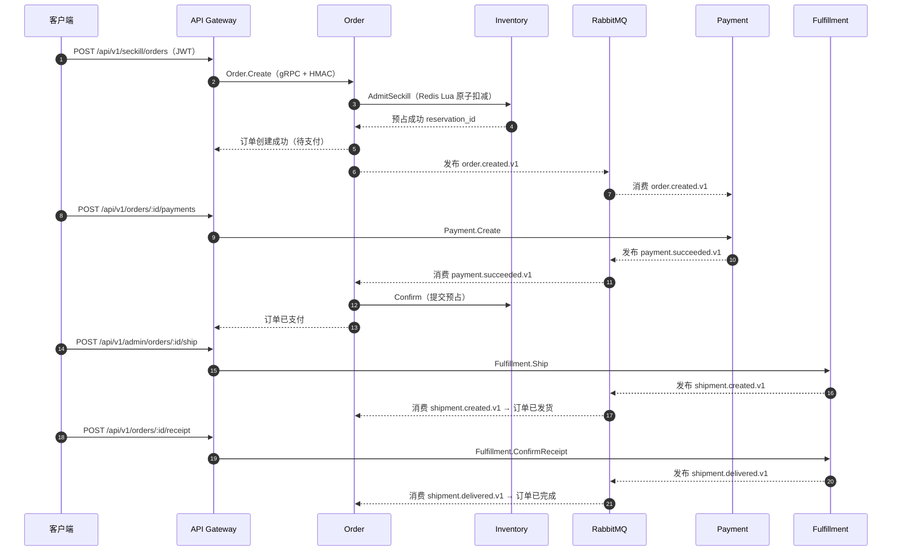

# Seckill Mall 架构示意图

本文档用 Mermaid 图直观展示系统的**组件功能**与**组件间关联**。代码是唯一客观事实，
当本文档与代码冲突时以代码为准并更新本文档。

## 1. 总体架构

> 说明：所有服务启动时向 etcd 注册并定时续约（Gateway 通过 etcd 解析下游地址）；
> 每个服务暴露 Prometheus metrics 和 Jaeger OTLP 遥测端点；`shared/*` 被所有服务引用。

## 2. 组件功能清单

| 组件 | 端口 | 职责 |
|------|------|------|
| API Gateway | 8080 | 唯一外部入口，`/api/v1/*` 路由、JWT 认证、内部调用 HMAC 签名注入、gRPC 客户端池 |
| Identity | 51001 | 注册/登录/刷新令牌（bcrypt 哈希 + JWT）、地址 CRUD 与地址快照 |
| Catalog | 51002 | 商品列表/详情、SKU 快照（供下单与购物车校验） |
| Inventory | 51003 | 库存预占/确认/释放/回补、秒杀准入；Redis Lua 原子操作 + Stream Outbox/Inbox |
| Cart | 51004 | 购物车项增删查、预览（调用 Catalog 校验 SKU） |
| Order | 51005 | 订单状态机唯一维护者（创建/取消/过期/支付/发货/收货/退款），SQL Outbox/Inbox |
| Payment | 51006 | 支付单创建/回调/退款，SQL Outbox/Inbox |
| Fulfillment | 51007 | 发货/确认收货/查询，SQL Outbox/Inbox |
| MySQL | 3306 | 各服务自有表存储，禁止跨库写 |
| Redis | 6379 | Inventory 库存状态与 Stream Outbox/Inbox（db 2） |
| RabbitMQ | 5672 | 事件总线 `commerce.events.v1`，每服务队列 + retry + DLQ |
| etcd | 2379 | 服务注册与发现 |
| Prometheus/Grafana | 9090/3000 | 指标采集与可视化 |
| Jaeger | 16686 | OTLP 分布式追踪 |

## 3. 组件间关联

### 3.1 同步调用（gRPC）

| 调用方 | 被调用方 | 接口 | 用途 |
|--------|----------|------|------|
| Gateway | Identity/Catalog/Inventory/Cart/Order/Payment/Fulfillment | 各服务 RPC | 转发 `/api/v1` 请求（注入 HMAC 身份） |
| Order | Catalog | `GetSKUSnapshot` | 下单时获取商品快照 |
| Order | Identity | `GetAddressSnapshot` | 下单时获取收货地址快照 |
| Order | Inventory | `Reserve`/`AdmitSeckill`/`Confirm`/`Release`/`Restock` | 库存生命周期管理 |
| Cart | Catalog | `GetSKUSnapshot` | 校验 SKU 并组装预览 |
| Payment | Order | `ConfirmPayment`/`Refund` | 支付结果回写订单状态 |
| Fulfillment | Order | `Ship`/`ConfirmReceipt` | 履约结果回写订单状态 |

### 3.2 异步事件（RabbitMQ `commerce.events.v1`）

| 事件 | 发布者 | 消费者 | 用途 |
|------|--------|--------|------|
| `seckill.accepted.v1` | Inventory | Order(no-op) | 秒杀准入事实 |
| `inventory.reserved.v1` | Inventory | Order(no-op) | 预占成功事实 |
| `inventory.released.v1` | Inventory | Order(no-op) | 释放预占事实 |
| `inventory.restocked.v1` | Inventory | Order(no-op) | 退款回补事实 |
| `order.created.v1` | Order | Payment | 触发支付单创建 |
| `order.cancelled.v1` | Order | Payment、Inventory | 取消支付单、释放/回补库存 |
| `payment.succeeded.v1` | Payment | Order、Fulfillment | 确认订单支付、触发待发货 |
| `payment.refunded.v1` | Payment | Order、Inventory | 订单退款、库存回补 |
| `shipment.created.v1` | Fulfillment | Order | 订单进入已发货 |
| `shipment.delivered.v1` | Fulfillment | Order | 订单进入已完成 |

### 3.3 数据所有权（禁止跨库写）

| 服务 | 自有数据 |
|------|----------|
| Identity | `users`、`refresh_tokens`、`user_addresses` |
| Catalog | `categories`、`spus`、`skus`、`product_images` |
| Inventory | `inventory_stock`、`inventory_reservations`、`seckill_activities`、`seckill_user_limits` |
| Cart | `cart_items` |
| Order | `commerce_orders`、`order_items`、`order_status_history`、`order_create_intents`、`order_operations`、`order_outbox_events`、`order_inbox_events` |
| Payment | `payments`、`refunds`、`payment_outbox_events`、`payment_inbox_events` |
| Fulfillment | `shipments`、`fulfillment_outbox_events`、`fulfillment_inbox_events` |

所有权契约在 `shared/contracts` 中定义并通过 `ValidateServiceBoundaries` 启动校验。

## 4. 秒杀核心链路（时序）

> 取消/退款链路：`POST /orders/:id/cancel` 经 Gateway → Order.Cancel，Order 同步调用
> Inventory `Release`/`Restock` 并发布 `order.cancelled.v1`；Payment 消费后同步退款。

## 5. 可靠性机制

- **Outbox**：业务状态与事件在同一数据库事务写入（Order/Payment/Fulfillment 用 SQL，
  Inventory 用 Redis Lua + Stream），由 Relayer 发布到 RabbitMQ。
- **Inbox**：消费端幂等去重，重复事件不产生重复事实。
- **有限重试 + DLQ**：手动 Ack，可恢复错误进入 retry 队列，attempt ≥ 5 进入死信队列。
- **内部调用认证**：Gateway 注入 HMAC 签名（`x-internal-*` header），下游校验方法名、
  身份、角色和时间窗（±30s），防止绕过 Gateway 直连。
- **幂等**：确定性 request/event ID + 状态机校验，同步 gRPC 与异步事件重复执行安全。

## 6. 代码位置索引

| 内容 | 位置 |
|------|------|
| 服务入口 | `services/<service>/cmd/<service>-service/main.go` |
| 服务私有实现 | `services/<service>/internal/app/` |
| 本地配置 | `services/<service>/etc/` |
| gRPC 契约与生成代码 | `shared/proto/commerce/`、`shared/gen/commerce/` |
| 事件与数据所有权契约 | `shared/contracts/` |
| 平台能力（配置/发现/认证/MQ/遥测） | `shared/platform/` |
| 数据库迁移 | `migrations/` |
| 编排与监控 | `docker-compose.yaml`、`deploy/` |
