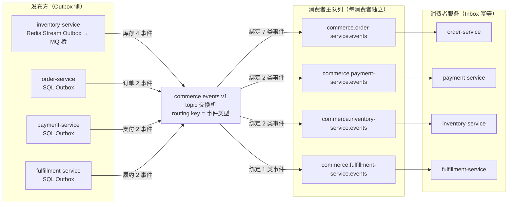
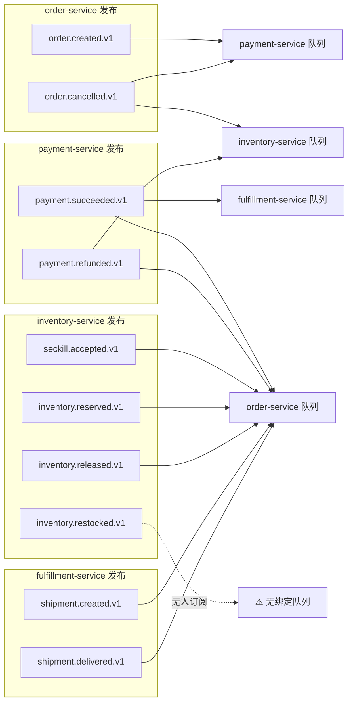
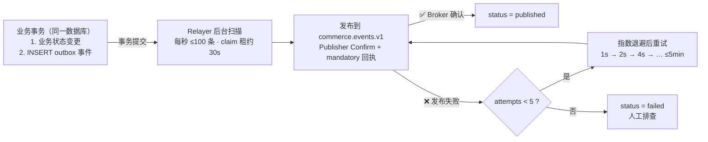
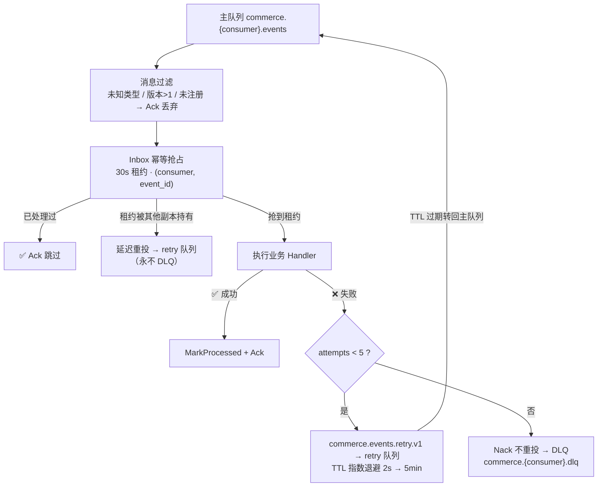

# RabbitMQ 消息投递全景图（投放表）

本文基于当前代码实现，用图表完整展示消息队列的**投递关系**：谁发布事件、事件如何经交换机
路由、投递给哪些消费者的哪些队列，以及失败后的重试/死信去向。代码是唯一客观事实，
本文与代码冲突时以代码为准并更新本文。

## 1. 总览：发布 → 交换机 → 队列 → 消费者

**核心结论：** 全部 10 类事件统一发布到 `commerce.events.v1`（topic 交换机），
routing key 就是事件类型本身；每个消费者拥有**独立主队列**，按订阅表绑定事件，
实现一对多的广播投递（fan-out）。

## 2. 事件级投递明细图（Fan-out）

## 3. 投放表（事件 → 发布者 → 消费者）

| 事件类型 | 发布者 | 投递队列 | 消费者 | 处理器行为 |
|---------|--------|---------|--------|-----------|
| `seckill.accepted.v1` | inventory-service | order.events | order-service | no-op（仅 Ack 幂等收敛） |
| `order.created.v1` | order-service | payment.events | payment-service | 创建支付单 |
| `order.cancelled.v1` | order-service | payment.events / inventory.events | payment、inventory | 取消支付单 / 回补库存 |
| `payment.succeeded.v1` | payment-service | order.events / fulfillment.events | order、fulfillment | 确认订单支付 / 创建发货单 |
| `payment.refunded.v1` | payment-service | order.events / inventory.events | order、inventory | 记录退款 / 回补库存 |
| `inventory.reserved.v1` | inventory-service | order.events | order-service | no-op（仅 Ack 幂等收敛） |
| `inventory.released.v1` | inventory-service | order.events | order-service | no-op（仅 Ack 幂等收敛） |
| `inventory.restocked.v1` | inventory-service | （无绑定） | — | ⚠️ 发布但无人订阅 |
| `shipment.created.v1` | fulfillment-service | order.events | order-service | 记录已发货 |
| `shipment.delivered.v1` | fulfillment-service | order.events | order-service | 记录已送达 |

## 4. 消费者订阅矩阵（队列三件套）

每个消费者有主队列 / retry 队列 / DLQ 队列三件套，主队列绑定 topic 交换机，
retry 队列绑定 `commerce.events.retry.v1`（direct，routing key = 消费者名），
DLQ 队列绑定 `commerce.events.dlx.v1`（direct，routing key = 消费者名）。

| 消费者 | 主队列 | 重试队列 | DLQ 队列 | 订阅事件 |
|--------|--------|---------|---------|---------|
| order-service | `commerce.order-service.events` | `.retry` | `.dlq` | seckill.accepted、payment.succeeded、payment.refunded、inventory.reserved、inventory.released、shipment.created、shipment.delivered |
| payment-service | `commerce.payment-service.events` | `.retry` | `.dlq` | order.created、order.cancelled |
| inventory-service | `commerce.inventory-service.events` | `.retry` | `.dlq` | order.cancelled、payment.refunded |
| fulfillment-service | `commerce.fulfillment-service.events` | `.retry` | `.dlq` | payment.succeeded |

## 5. 发送侧：Outbox 投递流程

- Order / Payment / Fulfillment：SQL Outbox，与业务状态变更同事务写入。
- Inventory：Redis Lua 在库存/秒杀状态变更的同一原子脚本中 `XADD` Stream Outbox，
  再由 `inventory-publisher` 消费组把 Stream 转发到 RabbitMQ（无 Redis 时用 MemoryEventStream）。

## 6. 消费侧：幂等、重试与死信流程

- 主队列死信策略：`x-dead-letter-exchange = commerce.events.dlx.v1`、routing key = 消费者名。
- retry 队列死信策略：`x-dead-letter-exchange = ""`（默认交换机）、routing key = 主队列名，
  即消息 TTL 过期后自动转回主队列再次消费。

## 7. 关键参数速查

| 参数 | 值 |
|------|-----|
| 事件交换机 | `commerce.events.v1`（topic） |
| 重试交换机 | `commerce.events.retry.v1`（direct） |
| 死信交换机 | `commerce.events.dlx.v1`（direct） |
| 消费重试上限 | 5 次（超过进 DLQ） |
| 消费重试 TTL | 指数退避 2s → 5min（`RetryDelay(attempt+1, 1s)`） |
| 发布重试上限 | 5 次（Outbox attempts） |
| 发布退避 | 指数 1s 基准，上限 5min |
| Outbox claim 租约 | 30s |
| Inbox 幂等租约 | 30s |
| Relayer 批量 | 100 条 / 秒 |
| QoS 预取 | 16 |
| 投递语义 | at-least-once + Inbox 幂等收敛 |
| 事件版本 | v1（EventVersion > 1 安全 Ack 丢弃） |

## 8. 已知边界（如实标注）

- `inventory.restocked.v1` 已发布但**无任何消费者订阅**，属于"记录型"事件。
- order-service 对 `seckill.accepted.v1`、`inventory.reserved.v1`、`inventory.released.v1`
  的 Handler 为 no-op（返回 nil 直接 Ack），不产生业务副作用。
- 不保证跨事件类型的全局顺序，正确性依赖状态机校验与幂等收敛。

## 9. 代码索引

| 内容 | 位置 |
|------|------|
| 事件类型与信封 | `shared/contracts/events.go` |
| 服务边界（发布/消费声明） | `shared/contracts/boundaries.go` |
| 拓扑声明、订阅路由表 `consumerEvents`、队列命名 | `shared/platform/messaging/rabbit.go` |
| 重试退避计算 | `shared/platform/messaging/types.go:135` |
| SQL Outbox / Inbox | `shared/platform/messaging/sql_store.go` |
| Outbox Relayer 轮询 | `shared/platform/messaging/worker.go` |
| 幂等消费公共流程 | `shared/platform/messaging/dispatch.go` |
| Outbox/Inbox 表结构 | `migrations/004_stage5_messaging.sql` |
| Inventory Redis Stream → RabbitMQ 桥 | `services/inventory/cmd/inventory-service/main.go` |
