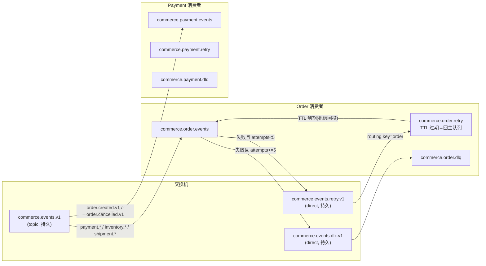
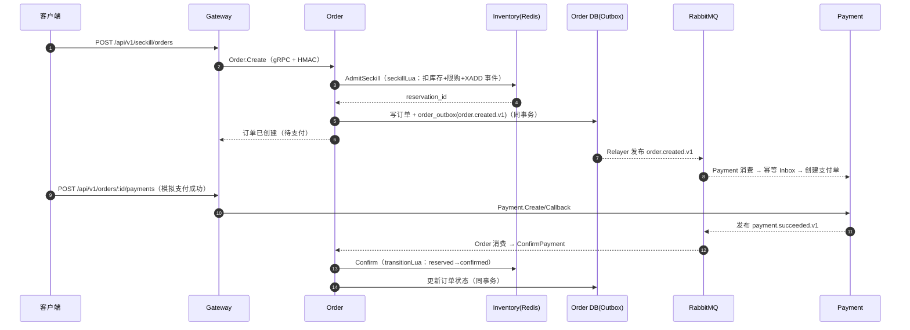

# Seckill Mall：Redis 与 RabbitMQ 深度解读

本文结合当前项目的真实实现，讲解 Redis 与 RabbitMQ 的用法和背后的工业化设计思路。
代码是唯一客观事实，本文与代码冲突时以代码为准并更新本文。

## 1. 定位：为什么需要两个中间件

| 中间件 | 在本项目中的角色 | 为什么用它 |
|--------|------------------|------------|
| Redis | 库存与秒杀的**热路径状态存储** | 秒杀是超高并发读改写场景，需要原子扣减 + 亚毫秒延迟；Redis 单线程 + Lua 脚本天然保证原子性 |
| RabbitMQ | **异步事件总线**（服务间最终一致） | 订单/支付/履约是跨服务长链路，需要可靠投递、重试、死信、多个消费者独立消费事件 |

一句话：**Redis 解决"同一瞬间大量并发扣减"的问题，RabbitMQ 解决"多个服务如何可靠地知道自己该做什么"的问题。**
两者各司其职，不存在"用谁替代谁"的关系。

## 2. 事件协议：一切消息的基础

所有跨服务消息都走 `shared/contracts` 定义的统一信封：

```go
type EventEnvelope struct {
    EventID       string          // 全局唯一，消息幂等键
    EventType     string          // 路由标识，如 order.created.v1
    EventVersion  int             // 信封/Payload 演进版本（当前恒为 1）
    AggregateType string          // 聚合类型，如 order
    AggregateID   string          // 聚合 ID，如订单号
    OccurredAt    time.Time       // 发生时间
    TraceID       string          // 分布式追踪 ID
    Payload       json.RawMessage // 业务载荷，保持 JSON 便于独立演进
}
```

工业化要点：

- **`event_id` 是幂等的基石**。消费者对同一个 `event_id` 只处理一次，这是 at-least-once 投递语义下不产生重复事实的前提。
- **`event_type` 带主版本后缀**（`.v1`），消费者按类型路由；**未知事件和未来版本直接 Ack 丢弃**（见 §5.4），保证新旧版本平滑演进。
- 事件类型全集（`shared/contracts/events.go`）：

| 事件 | 发布者 | 消费者 |
|------|--------|--------|
| `seckill.accepted.v1` | Inventory | Order |
| `inventory.reserved.v1` / `released.v1` / `restocked.v1` | Inventory | Order |
| `order.created.v1` / `order.cancelled.v1` | Order | Payment、Inventory |
| `payment.succeeded.v1` / `refunded.v1` | Payment | Order、Fulfillment |
| `shipment.created.v1` / `delivered.v1` | Fulfillment | Order |

## 3. 发送侧：Outbox 模式（保证"业务状态"与"发消息"一致）

### 3.1 要解决的经典问题：双写一致性

业务上经常需要"改数据库 + 发消息"两步。如果先发消息再改库，消费者可能读到旧状态；
先改库再发消息，消息可能发送失败，导致下游永远不知道发生了什么。
这就是**分布式事务中的双写问题**。

### 3.2 解决方案：本地消息表（Outbox）

Outbox 的思路是：**把"发消息"降级为"在同一数据库事务里写一行事件记录"**。
事务提交后由后台 Relayer 扫描该表并真正发布到 MQ。业务状态和事件要么一起成功，要么一起回滚。

```
业务请求
   │
   ▼
┌──────────────────────────┐
│ 单事务（同一数据库）        │
│ 1. 更新订单状态            │
│ 2. INSERT order_outbox    │  ← 事件作为"事实"持久化
└──────────────────────────┘
   │ 事务提交
   ▼
Relayer 轮询 outbox 表 → 发布到 RabbitMQ → 标记 published
```

### 3.3 SQL Outbox（Order / Payment / Fulfillment）

以 Order 为例（`services/order/internal/app/mysql_repository.go`）：
创建订单的整个业务逻辑在 `gorm` 事务里完成，最后调用 `AppendTx` 把
`order.created.v1` 事件写入 `order_outbox_events` 表——**与订单行同一事务**。

表结构（`migrations/004_stage5_messaging.sql`）关键点：

- `event_id` 有 `UNIQUE KEY`，防止重复写入。
- `status` 为 `pending → publishing → published / failed` 的状态机。
- `attempts` 记录发布尝试次数，`next_retry_at` 控制退避。
- 索引 `(status, next_retry_at)` 支撑 Relayer 扫描。

**Relayer**（`shared/platform/messaging/worker.go`）每个服务一个，每秒扫描一批（默认 100 条）：

```text
Claim（SELECT ... FOR UPDATE SKIP LOCKED，租约 30s）
  → 逐条 Publish 到 RabbitMQ
  → 成功：MarkPublished
  → 失败：attempts >= 5 ? MarkFailed : MarkRetry(now + 指数退避)
```

工业化要点：

- **`FOR UPDATE SKIP LOCKED`**：多个 Relayer 副本并发扫描时互不阻塞，各自拿不同行，天然支持水平扩展。
- **租约（lease）**：`Claim` 时把 `next_retry_at` 推到 30s 后并置为 `publishing`。
  若进程在发布中崩溃，租约过期后记录会重新回到可扫描集合，**不丢消息**。
- **发布失败不是永久失败**：写回 `next_retry_at` 按指数退避（`RetryDelay`：1s、2s、4s……封顶 5 分钟），
  超过 5 次才标记 `failed` 留待人工排查。

### 3.4 Redis Stream Outbox（Inventory）

Inventory 的状态在 Redis 而不是 MySQL，所以它的 Outbox 是 **Redis Stream**，
并且**状态变更与事件追加在同一个 Lua 脚本里完成**（详见 §6.3）：

```lua
-- reserveLua（节选）
redis.call('DECRBY', KEYS[1], quantity)          -- 扣库存
redis.call('HSET', KEYS[3], 'status', 'reserved', ...)  -- 写 reservation
redis.call('XADD', KEYS[4], '*', 'event_id', ARGV[7], 'event_type', ARGV[8], 'payload', ARGV[9])
return 1
```

`XADD` 与扣减在同一原子脚本内，等价于 SQL Outbox 的"同事务"。Redis 本身不丢持久化数据
（AOF + RDB），Stream 即 Inventory 的本地消息表。

**Stream → RabbitMQ 桥**（`services/inventory/cmd/inventory-service/main.go`）：

```text
XReadGroup（消费组读取新事件，block 1s）
XAutoClaim（回收其他副本超时未 Ack 的 pending 事件，min-idle 30s）
  → 发布到 RabbitMQ
  → XAck 确认
```

工业化要点：**消费组 + `XAutoClaim`** 与 SQL 的 `SKIP LOCKED` 是同一思想——多副本并发消费
不重复，崩溃后由其他副本接管。Redis 只是"准 Outbox"，真正的消息分发仍由 RabbitMQ 承担。

## 4. RabbitMQ 拓扑与发布可靠性

### 4.1 拓扑设计

`DeclareTopology`（`shared/platform/messaging/rabbit.go`）声明了统一拓扑：



设计决策：

- **topic 交换机 + 事件类型路由键**：发布者只按事件类型发，不需要知道谁订阅。
- **每个消费者一条独占主队列**：按消费者隔离消费进度，Order 消费慢了不影响 Payment；
  增加新的消费者服务只需要新增 `consumerEvents` 注册。
- **retry 队列靠 TTL + 死信回投**：`x-dead-letter-exchange=""`、`x-dead-letter-routing-key=主队列名`，
  消息在 retry 队列里睡到 TTL 到期自动回到主队列重新投递，无需额外的调度器。
- **DLQ 独立交换机**：超过最大重试次数的消息进死信队列，便于人工/脚本补偿。

### 4.2 发布可靠性（RabbitPublisher）

`RabbitPublisher.Publish` 组合了四重保障：

1. **Publisher Confirm**：`ch.Confirm(false)` 后每次发布等待 Broker 确认（`Confirmation.Ack`），
   Broker 落盘成功才返回成功，否则报错触发 Outbox 重试。
2. **mandatory + Return**：发布时 `mandatory=true`，若消息没有队列可投递，Broker 通过
   `NotifyReturn` 回传，避免"以为发出去了其实没人消费"。
3. **消息持久化**：`DeliveryMode: Persistent` + topic/queue 均 durable，Broker 重启不丢消息。
4. **串行确认**：单 Channel + 互斥锁串行等待 confirm，避免多协程并发导致 delivery tag 错配
   （这是 RabbitMQ 客户端最常见的高并发陷阱之一）。

发布失败时 `Publish` 会先重连再重试一次；仍失败则返回错误，由 Outbox Relayer 走退避重试。

### 4.3 可观测性透传

发布时 `tracer.InjectAMQPHeaders` 把 OTel 的 `traceparent` 注入消息头，消费时
`ExtractAMQPHeaders` 恢复，同时信封自带 `trace_id`——一次下单从 Gateway 到
Order/Inventory/Payment 的整条链路在 Jaeger 里可以串起来。

## 5. 消费侧：Inbox 幂等 + 有限重试 + 死信

### 5.1 消费主流程（RabbitConsumer.handleDelivery）

```text
收到消息
  → UnmarshalEnvelope 失败？  → Nack 进死信
  → 未知事件 / 未来版本？     → Ack 跳过（向前兼容）
  → 本消费者没注册该类型？    → Ack 跳过
  → Inbox.Claim(consumer, event_id, 租约30s)
      ├─ Processed  → Ack（重复投递，幂等收敛）
      ├─ 未 Claim 到  → 重新投递到 retry 队列（租约被其他副本持有）
      └─ Claim 到 → 执行业务 handler
           ├─ 成功 → MarkProcessed → Ack
           └─ 失败 → MarkFailed → attempts >= 5 ? Nack进DLQ : 进retry队列
```

### 5.2 Inbox 为什么能保证幂等

Inbox 是消费者**自己的**已处理记录表。`(consumer, event_id)` 唯一键保证同一事件只处理一次：

- **SQL Inbox**：`INSERT ... ON DUPLICATE KEY` 语义（唯一键冲突即已见过）；
  未处理且租约过期时 `UPDATE ... WHERE updated_at=旧值` 原子地抢占（`attempts+1`），
  靠 `RowsAffected==1` 判定是否抢到，多副本不会重复处理。
- **Redis Inbox**：值格式 `processing:N`，用 Lua 脚本原子完成"不存在则创建 / 已处理则跳过 /
  租约过期则 attempts+1"三态判断（详见 §6.4）。

### 5.3 租约（lease）的两种用途

- **Outbox 租约**：防止 Relayer 崩溃后消息永远滞留。
- **Inbox 租约**：防止"正在处理中"的事件被另一个副本重复处理。
  处理时间超过 30s 租约过期后，其他副本可以接管并 `attempts+1`；
  原副本若最终成功 `MarkProcessed`，接管副本看到 `processed` 会直接 Ack。

### 5.4 重试与死信

- **有限重试**：`maxAttempts = 5`。指数退避通过 retry 队列的 TTL 实现
  （`Expiration = RetryDelay(attempt, 1s)`：1s、2s、4s、8s、16s）。
- **attempts 的真相来源**：消费时 `Inbox.Claim` 返回的尝试次数，不信任消息头
  （消息头可被伪造/污染），这是审计修复中强调过的安全点。
- **超过 5 次**：`Nack(requeue=false)`，主队列的死信配置把消息路由进 DLQ。
- **忙循环防护**：租约被持有时的重投走 retry 队列（带延迟），而不是立即 requeue，
  避免多个副本对同一事件互相踢皮球形成 CPU 忙循环。

### 5.5 QoS 预取与手动 Ack

- `ch.Qos(16, 0, false)`：每个消费者最多 16 条未确认消息在途，防止一次性拉爆内存、
  也防止单条慢消息阻塞整个队列。
- **Ack 时机**：业务成功且 `MarkProcessed` 落库后才 Ack。这样"处理了但没 Ack"
  的窗口内进程崩溃，消息会重新投递，而 Inbox 保证重复投递不重复处理——
  这是 **at-least-once + 幂等** 的标准组合。

## 6. Redis：库存热路径的工程实践

### 6.1 为什么秒杀必须用 Redis 而不是 MySQL

秒杀场景是"同一瞬间上万人抢同一个 SKU"：MySQL 行锁 + 事务在这种争抢下吞吐极低，
且超卖风险高。Redis 单线程执行命令，Lua 脚本整体原子，**没有并发竞态**，
单实例轻松支撑每秒数万次扣减。

### 6.2 键空间设计

| 键 | 类型 | 含义 |
|----|------|------|
| `inventory:stock:<sku_id>` | String | 剩余库存 |
| `inventory:users:<activity_id>:<sku_id>` | Hash | 秒杀活动每人已购数量（限购） |
| `inventory:reservation:<reservation_id>` | Hash | 预占单（status/order_id/user_id/sku_id/quantity/…） |
| `inventory:events` | Stream | Inventory 的事件 Outbox |
| `inventory:inbox:<consumer>:<event_id>` | String | Inventory 消费者的幂等记录 |

前缀全部可配置（`RedisStoreOptions`），生产环境不同环境隔离靠 Redis DB/前缀区分。

### 6.3 Lua 原子脚本解读

**普通预占 `reserveLua`**（`services/inventory/internal/app/redis_store.go`）：

```text
1. HGET reservation 状态 → 已存在则返回 10（重复预占，幂等）
2. 库存键不存在 → 返回 0（未播种）
3. 库存 < 数量 → 返回 2（库存不足）
4. DECRBY 扣库存 + HSET 写预占单 + XADD 写事件 Outbox
5. 返回 1（成功）
```

**秒杀准入 `seckillLua`** 额外多一步限购校验：

```text
current = HGET users哈希 userID  (该用户此活动已购数量)
current + quantity > limit → 返回 3（超出限购）
```

**状态转换 `transitionLua`**（Confirm/Release/Restock）是状态机：

```text
reservation 不存在 → 0
已是目标状态    → 1（幂等，重复命令直接成功）
订单不匹配      → 5（防止 A 订单释放 B 订单的预占）
当前状态 ≠ 期望前驱状态 → 4（如 restocked 只允许从 confirmed 来）
合法转换：
  reserved → confirmed（Confirm，支付成功提交库存）
  reserved → released （Release，未支付取消回补）
  confirmed → restocked（Restock，退款回补）
释放/回补时 INCRBY 还库存；秒杀单同步回滚限购计数
转换成功后按需 XADD 事件
```

错误码汇总：`0` 未初始化/不存在，`1` 成功/已是最新状态，`2` 库存不足，
`3` 超出限购，`4` 状态机非法转换，`5` 订单归属不匹配，`10` 预占已存在。

### 6.4 Redis Inbox 的租约语义（Lua）

`claimInboxScript` 一次原子完成三种情况：

```text
键不存在              → 写 processing:1 + PX 30s，返回 {claimed=1, attempts=1}
键 = processed       → 返回 {processed, attempts}
键 = processing:N
  ├─ 剩余 TTL > 0    → 返回 {未抢到, N}（别的副本在处理，走延迟重投）
  └─ 剩余 TTL <= 0   → 写 processing:(N+1) + PX 30s，返回 {claimed=1, N+1}
```

`MarkProcessed` 把键置为 `processed` 并保留 7 天（`EX 604800`），供重复投递收敛；
`MarkFailed` 只是**续租**（重置 PX），不删键——attempts 语义与 SQL Inbox 完全对齐，
失败次数真实累加，最终 5 次进 DLQ。

### 6.5 播种与降级

- 启动时 `SeedStock` 用 **SETNX** 播种，**不覆盖已有库存**（重启不重置已扣减数据）。
- 默认库存 `{1: 100}`；生产通过 `SECKILL_INVENTORY_STOCK`（JSON）或配置 `stock:` 指定。
- 未配置 Redis 时服务自动降级到 `MemoryStore` + `MemoryEventStream`（本地开发/测试），
  真实环境（release 模式 + Redis 地址）才走 Lua 热路径。

## 7. 端到端链路走读：秒杀下单



失败分支（取消）：Order.Cancel 同步调用 Inventory `Release`（Lua 回补库存并 XADD
`inventory.released.v1`），同时写 `order.cancelled.v1`；Payment 与 Inventory 各自消费
补偿。整个链路**每个服务只对自己拥有的数据负责**，跨服务靠事件最终一致。

## 8. 工业化场景对照：本项目实践 vs 通用最佳实践

| 主题 | 本项目实现 | 工业化通用实践 | 一致？ |
|------|------------|----------------|--------|
| 双写一致性 | SQL Outbox / Redis Lua+XADD | 本地消息表（Outbox）是主流方案；亦可对比事务消息、TCC | ✅ |
| 投递语义 | at-least-once + Inbox 幂等 | 生产系统几乎都用 at-least-once + 幂等，而非昂贵的 exactly-once | ✅ |
| 发布确认 | Publisher Confirm + mandatory + 持久化 | 标准组合，缺失任一都会丢消息 | ✅ |
| 重试策略 | 指数退避，5 次上限，独立 DLQ | 指数退避 + 死信 + 告警是标准做法 | ✅ |
| 多消费者隔离 | 每消费者独立队列 + 独立 Inbox | 标准：队列是消费者的"进度水位" | ✅ |
| 消费并发 | QoS 预取 16，单连接多协程 | 可调；本项目 handler 内串行处理，适合先保正确 | ⚠️ 偏保守 |
| 顺序性 | 不保证跨聚合全局顺序 | 需要严格顺序时用单一分区/单一消费者或序列号 | ⚠️ 依赖状态机兜底 |
| 消息过期 | 未用 TTL 清消息，用 DLQ 兜底 | 长周期补偿任务也常见 | ✅ |
| 监控告警 | Prometheus 指标 + Jaeger 追踪 | 还应监控队列积压、DLQ 增长、消费延迟并告警 | ✅（指标已埋点） |

### 8.1 关于消息顺序的客观说明

RabbitMQ 单队列 + 单消费者时，同一队列内消息按发布顺序投递。本项目**没有承诺跨事件类型
的全局顺序**，正确性由两层保证：

1. **确定性状态机**：Inventory 的 reservation 状态转换、Order 的订单状态机都校验"当前状态
   是否允许该转换"，乱序/重复事件要么幂等返回、要么报状态冲突。
2. **业务事实自带顺序信息**：`OccurredAt`、状态机前驱约束让事件可以"迟到但不乱认账"。

如果需要强顺序（例如同一订单的支付与退款事件必须有序），工业化上会用
**单一队列 + 按聚合 ID 分桶/串行消费者**，本项目当前未做，属于已知边界。

### 8.2 可以继续演进的方向（不构成本次改动）

- Outbox 加 `published_at` 和发布延迟告警，接入队列积压面板。
- 消费 handler 支持并发（按 event_id 分片），把 QoS 提高到 32~64 提升吞吐。
- 为 DLQ 配置专门的补偿 worker（自动重放 + 死信告警）。
- Redis Inbox 的 `processed` 记录 7 天后过期，重放极端延迟事件会失去幂等保护——可评估加长保留期。

## 9. 代码索引

| 内容 | 位置 |
|------|------|
| 消息类型/接口/退避/信封序列化 | `shared/platform/messaging/types.go` |
| RabbitMQ 拓扑、发布、消费、重试/DLQ | `shared/platform/messaging/rabbit.go` |
| SQL Outbox/Inbox | `shared/platform/messaging/sql_store.go` |
| Memory Outbox/Inbox（本地开发） | `shared/platform/messaging/memory_store.go` |
| Outbox Relayer 轮询 | `shared/platform/messaging/worker.go` |
| 消费者断线重连 | `shared/platform/messaging/runtime.go` |
| 幂等消费公共流程 | `shared/platform/messaging/rabbit.go`（`handleDelivery`/`lookupHandler`） |
| 事件信封与事件类型 | `shared/contracts/events.go`、`payloads.go` |
| 服务边界与事件路由注册 | `shared/contracts/boundaries.go` |
| Redis Lua 状态机 + Stream Outbox | `services/inventory/internal/app/redis_store.go` |
| Redis Stream 消费组/自动认领 | `services/inventory/internal/app/stream_outbox.go` |
| Redis Inbox 租约脚本 | `services/inventory/internal/app/redis_inbox.go` |
| Stream → RabbitMQ 桥 | `services/inventory/cmd/inventory-service/main.go` |
| 各服务事件处理器 | `services/{order,payment,fulfillment,inventory}/internal/app/events.go` |
| Outbox/Inbox 表结构 | `migrations/004_stage5_messaging.sql` |
| 编排（RabbitMQ/Redis 部署） | `docker-compose.yaml` |
