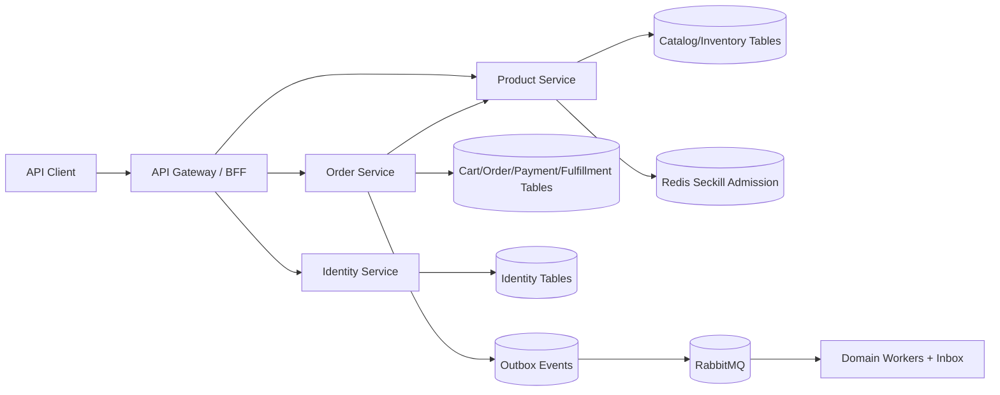

# 技术设计: 后端完整商城 MVP

## 技术方案

### 核心技术
- 保持 Go、Gin、gRPC、GORM、MySQL、Redis、RabbitMQ、etcd 和 OpenTelemetry 技术栈。
- 使用 `golang.org/x/crypto/bcrypt` 进行密码哈希；使用现有 JWT 库签发访问令牌。
- 使用版本化 SQL migration 管理表结构，不依赖启动时自动建表。

### 实现要点
- 采用增量式受控微服务：Identity 独立，Catalog/Inventory 归 Product Service，Cart/Order/Payment/Fulfillment 在交易域内先模块化、后按负载拆分。
- 新代码使用 `cmd/<process>` + `internal/<domain>`；旧入口保留兼容包装，迁移完成后再删除。
- 使用显式构造函数注入 Repository、Clock、ID Generator、Token Issuer 和 Event Publisher。
- 金额统一为 `int64 amount_cents`；订单项保存名称、SKU、单价和地址快照。
- 普通库存使用 MySQL 条件更新和 reservation；秒杀库存使用 Redis Lua 准入，但最终状态由 Inventory 模块持有。
- 本地事务与 Outbox 同步提交；消费者使用 Inbox 或唯一键保证幂等，不引入分布式事务。

## 架构设计

## 架构决策 ADR

### ADR-001: 采用增量式受控微服务
**上下文:** 当前服务数量已经较多，但内部边界仍弱；直接拆出用户、购物车、支付、履约等大量独立服务会放大运维成本。
**决策:** 保留 Gateway、Product、Order 和消息 Worker 拓扑，新增 Identity；交易域内部先以独立包隔离 Cart、Payment、Fulfillment。
**理由:** 能维护清晰领域边界，同时避免过早产生十余个部署单元。
**替代方案:** 完整微服务拆分 → 拒绝原因: 当前规模和测试基础不足。模块化单体重写 → 拒绝原因: 会丢失现有秒杀微服务与消息链路的演进价值。
**影响:** 需要通过接口与表所有权约束模块，未来可按负载拆分。

### ADR-002: 同一 MySQL 实例内实施领域数据所有权
**上下文:** 本地环境只有一个 MySQL，但当前消费者会跨订单和商品表写事务。
**决策:** 开发环境可共享实例，Identity、Catalog/Inventory、Trade 使用独立表集合，只有所有者可写；跨域通过 gRPC 和事件协作。
**理由:** 兼顾本地成本与未来独立数据库部署能力。
**替代方案:** 继续共享表事务 → 拒绝原因: 服务无法独立演进。立即部署多个 MySQL → 拒绝原因: 本地复杂度收益不足。
**影响:** 库存与订单改为最终一致，需要预占、释放和幂等事件。

### ADR-003: 金额使用最小货币单位整数
**上下文:** 当前 Protobuf 和 Go 使用 `float/float32`，存在舍入风险。
**决策:** 新 API、消息和模型统一使用 `int64 amount_cents`，旧字段在兼容期只读转换。
**理由:** 金额计算确定且容易比较、审计。
**替代方案:** decimal 第三方库 → 拒绝原因: 当前仅处理人民币两位小数，整数分更简单。
**影响:** 需要数据库与 Proto 兼容迁移。

### ADR-004: 本地事务加 Outbox/Inbox
**上下文:** 订单、库存和支付跨领域，不应依赖跨库事务。
**决策:** 每个领域只提交本地状态和 Outbox；消费者写 Inbox 后处理事件，事件包含 `event_id`、`event_type`、`event_version` 和 trace headers。
**理由:** 与现有 Outbox 基础一致，并能形成明确幂等边界。
**替代方案:** 分布式事务 → 拒绝原因: 复杂且不适合当前系统。
**影响:** API 返回需要表达处理中状态，补偿与监控必须完整。

## API 设计

所有新接口位于 `/api/v1`，使用统一响应 `{code, message, data, request_id}`。

### Identity
- `POST /api/v1/auth/register`
- `POST /api/v1/auth/login`
- `POST /api/v1/auth/refresh`
- `POST|GET /api/v1/addresses`
- `PUT|DELETE /api/v1/addresses/:id`

### Catalog 与 Cart
- `GET /api/v1/products`
- `GET /api/v1/products/:id`
- `POST|GET /api/v1/cart/items`
- `PUT|DELETE /api/v1/cart/items/:sku_id`

### Order、Payment 与 Fulfillment
- `POST /api/v1/orders`，要求 `Idempotency-Key`。
- `GET /api/v1/orders`、`GET /api/v1/orders/:order_id`。
- `POST /api/v1/orders/:order_id/cancel`。
- `POST /api/v1/payments/mock`、`POST /api/v1/payments/mock/callback`。
- `POST /api/v1/admin/orders/:order_id/ship`。
- `POST /api/v1/orders/:order_id/confirm`。
- `POST /api/v1/orders/:order_id/refunds`。

### 兼容策略
- 现有 `/login`、`/product/:id`、`/order`、`/order/:order_id` 暂时保留并标记 deprecated。
- 新客户端只使用 `/api/v1`。

## 数据模型

新增表按领域组织：
- Identity: `users`、`refresh_tokens`、`user_addresses`。
- Catalog/Inventory: `categories`、`spus`、`skus`、`product_images`、`inventory_reservations`、`seckill_activities`。
- Trade: `cart_items`、扩展后的 `orders`、`order_items`、`order_status_history`、`payments`、`refunds`、`shipments`。
- Messaging: 扩展 `outbox_events`，新增 `inbox_events`。

关键约束：
- 用户账号、订单幂等键、支付流水号、事件 ID 和 Inbox 消费键必须唯一。
- 库存预占记录包含 `reserved/confirmed/released/expired` 状态及过期时间。
- 订单状态变更使用条件更新和状态历史，禁止无约束覆盖状态。

## 安全与性能
- **认证:** bcrypt、短期 Access Token、Refresh Token 哈希存储和轮换；JWT Secret 启动时强度校验。
- **授权:** 用户资源校验 owner_id，运营接口要求 admin 角色。
- **支付:** 仅 Mock/沙箱；回调使用独立签名密钥和幂等流水号，不记录敏感请求头。
- **输入:** 所有 ID、数量、分页和文本长度显式校验；错误响应不返回 SQL、Redis 或 gRPC 原始错误。
- **性能:** 商品列表游标/分页；购物车批量查 SKU；库存条件更新；Outbox/Inbox 建立状态和时间索引。
- **高风险操作:** Debug reset 仅在显式开发配置下注册，禁止在生产模式启用。

## 测试与部署
- **单元测试:** 状态机、金额、Token、库存 reservation、幂等和权限。
- **集成测试:** MySQL migration/repository、Redis Lua、Outbox/Inbox、Mock 支付回调。
- **端到端验收:** 注册登录 → 地址 → 商品 → 购物车 → 下单 → 支付 → 发货 → 收货；取消与退款；秒杀订单超时释放。
- **部署:** 每个业务进程提供 Dockerfile、health/readiness 和优雅停机；Compose 提供完整本地拓扑。
- **质量门禁:** `gofmt`、`go test ./...`、`go vet ./...`、migration 重放和 API 验收全部通过。

