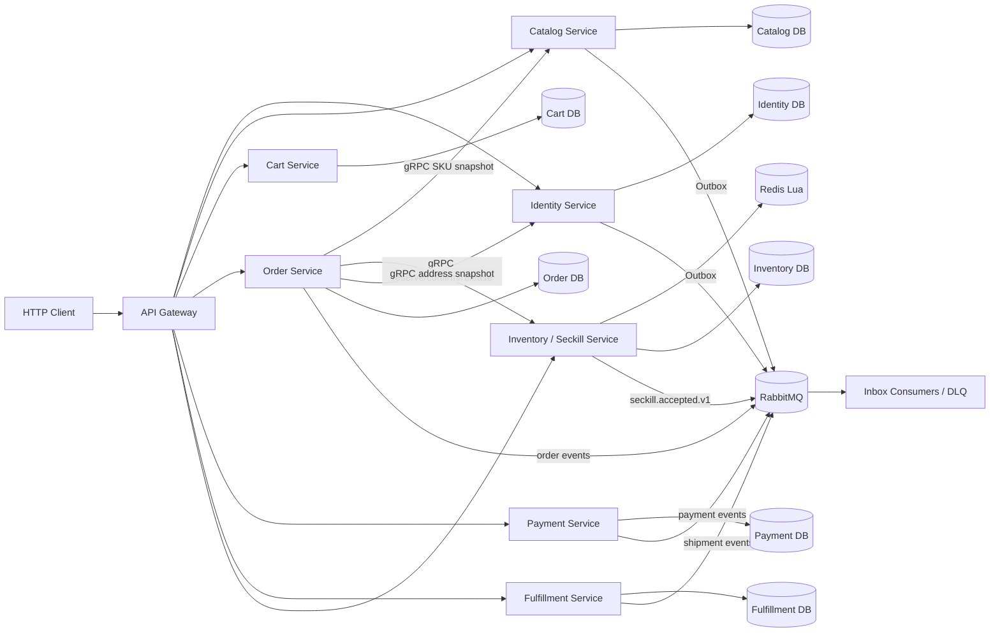

# 技术设计: 微服务商城与秒杀统一架构迁移

## 技术方案

### 核心技术

- Go、Gin、gRPC、Protobuf、etcd 服务发现。
- MySQL 按服务划分数据库/表所有权；Redis Lua 承担秒杀热点准入。
- RabbitMQ Topic Exchange 承担领域事件，Outbox/Inbox 保障可靠投递和消费幂等。
- OpenTelemetry、Prometheus、Jaeger 保留现有观测能力。
- 前端继续暂缓，以 Gateway HTTP API、OpenAPI、curl/Postman 和管理面板作为验收入口。

### 实现要点

1. 将当前 `internal/commerce.Service` 和总 `Repository` 拆为服务边界内的应用服务与 Repository，禁止新服务直接依赖 `internal/commerce` 的数据库实现。
2. 先建立稳定的服务契约：Catalog 查询 SKU 快照，Inventory 预占/确认/释放/秒杀准入，Order 创建/查询，Payment 回调，Fulfillment 发货和收货。
3. 同步调用使用 gRPC：订单创建时读取商品和地址快照、预占库存；异步状态变化使用 RabbitMQ：订单创建、支付成功、订单取消、发货和退款。
4. 订单服务拥有唯一订单状态机；Payment、Inventory、Fulfillment 只能维护自己的状态并发布事件，不得跨表修改订单。
5. 秒杀服务保留 Redis Lua 热路径，但将准入结果通过 RabbitMQ 投递到 Order Service；失败、超时和重复请求必须有补偿和幂等边界。
6. 每个服务的 Outbox Publisher 只访问自己的 Outbox 表；不能由一个全局 Worker 直接读取所有服务数据库。

## 架构设计

## 架构决策 ADR

### ADR-001: 采用渐进式微服务拆分

**上下文:** 当前新商城已经具备完整业务功能，但集中在单个 `commerce-api` 进程；旧秒杀链路已有 gRPC/MQ，却使用另一套订单模型。

**决策:** 先建立统一契约和数据所有权，再按 Catalog/Inventory、Order、Identity/Cart、Payment/Fulfillment 的顺序逐步提取服务。每阶段通过 Gateway 切换并进行验收。

**理由:** 能保留当前可运行能力，降低大规模重写和数据迁移风险，并使每次拆分都产生可观察的微服务链路。

**替代方案:** 全量重写 → 风险过高；继续维护新旧两条链路 → 无法解决领域重复和展示割裂。

**影响:** 迁移期间会同时存在过渡适配层和目标服务，但只能有一个新商城订单真源；所有过渡状态必须记录在文档和验收报告中。

### ADR-002: 订单状态只由 Order Service 维护

**上下文:** 当前旧 MQ Consumer 会跨写旧 `orders` 和 `product` 表，新商城 Repository 也在一个本地事务内维护多个领域。

**决策:** Order Service 独占订单、订单项和订单状态历史；其他服务通过 gRPC 命令或事件协作，不直接写订单表。

**理由:** 保证状态机唯一，避免重复订单真源和跨服务数据库事务。

**替代方案:** 继续由 MQ Consumer 跨表事务更新 → 服务无法独立部署和演进。

**影响:** 支付、库存和履约转换为最终一致，需要 Inbox、超时扫描和补偿事件。

### ADR-003: 服务数据库按所有权隔离

**上下文:** 本地可以共用一个 MySQL 实例，但共享表和跨服务写表会固化耦合。

**决策:** 开发环境使用同一 MySQL 实例下的独立数据库/表前缀，服务使用独立 DSN 和 migration；生产环境可进一步拆分实例。

**理由:** 兼顾本地成本与服务独立性，迁移时可以逐表核对。

**替代方案:** 所有服务共享 `commerce_*` 表 → 仍然是分布式部署的单体数据库。

**影响:** 需要通过快照、gRPC 和事件传递跨服务数据，订单必须保存商品和地址快照。

## API设计

### 内部 gRPC 服务

- `CatalogService.GetSKUSnapshot`：返回 SKU 名称、编码、价格和销售状态。
- `IdentityService.GetAddressSnapshot`：按用户和地址返回可用于订单快照的地址。
- `InventoryService.Reserve`：普通订单库存预占，使用 reservation_id 幂等。
- `InventoryService.Confirm`：支付成功后确认预占。
- `InventoryService.Release`：取消、超时或失败时释放预占。
- `SeckillService.Admit`：Redis Lua 校验活动、库存和限购，返回 admission_id。
- `OrderService.Create` / `Get`：创建和查询统一订单。
- `PaymentService.Create`：创建支付单；回调由 Payment Service 自己接收。
- `FulfillmentService.Ship`：管理员发货并生成物流单。

### RabbitMQ 事件

统一事件信封包含：`event_id`、`event_type`、`event_version`、`aggregate_type`、`aggregate_id`、`occurred_at`、`trace_id` 和 JSON payload。

- `seckill.accepted.v1`
- `order.created.v1`
- `order.cancelled.v1`
- `payment.succeeded.v1`
- `payment.refunded.v1`
- `inventory.reserved.v1`
- `inventory.released.v1`
- `shipment.created.v1`
- `shipment.delivered.v1`

## 数据模型

服务所有权目标：

- Identity：`users`、`refresh_tokens`、`user_addresses`。
- Catalog：`categories`、`spus`、`skus`、`product_images`。
- Inventory/Seckill：`inventory_stock`、`inventory_reservations`、`seckill_activities`、用户限购记录。
- Cart：`cart_items`。
- Order：`commerce_orders`、`order_items`、`order_status_history`、`order_outbox_events`、Order Inbox。
- Payment：`payments`、`refunds`、Payment Outbox/Inbox。
- Fulfillment：`shipments`、Fulfillment Outbox/Inbox。

迁移期间旧 `orders`、`product`、`outbox_events` 只供旧兼容链路使用，禁止新服务继续写入。

## 安全与性能

- gRPC 服务必须在服务端再次校验用户和角色，不能只信任 Gateway 传入的 user_id。
- 事件 payload 不包含密码、Token、支付签名和非必要地址明文；日志只记录业务 ID。
- 所有跨服务命令携带幂等键和 deadline；RabbitMQ 消费使用手动 Ack、重试队列和 DLQ。
- 秒杀热点路径使用 Redis Lua；数据库库存作为最终账本，必须提供 Redis 与数据库 reconciliation。
- 不使用跨数据库事务；Saga 失败通过 release、cancel 和 refund 事件收敛。

## 测试与部署

- 阶段测试：每次拆分先运行 `go test ./...`、`go vet ./...`、`go test -race ./internal/...` 和进程级 Fake E2E。
- 契约测试：验证 gRPC 请求/响应字段、事件版本、重复消费和未知事件处理。
- 真实集成：Docker 可用时执行 MySQL migration、Redis Lua、RabbitMQ publisher confirm、DLQ 和 Compose 健康检查；不可用时明确跳过并保留替代验收记录。
- 部署：每个服务独立镜像和配置；Gateway 只依赖服务发现或服务地址，不依赖业务数据库。
