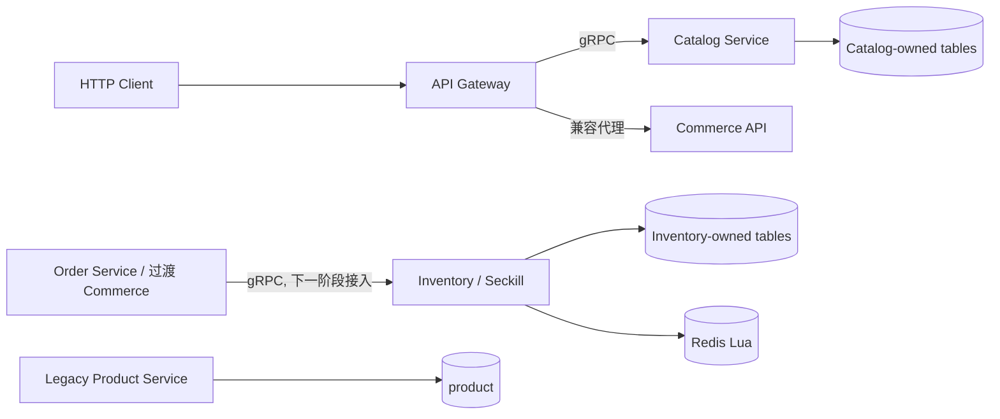

# 技术设计: Catalog 与 Inventory/Seckill 服务拆分

## 技术方案

### 核心技术

- Go、gRPC、Protobuf、GORM、MySQL、Redis Lua。
- `google.golang.org/grpc/test/bufconn` 作为不依赖 Docker 的契约集成测试传输。

### 实现要点

1. `catalog_service` 使用独立 `Product`、`SKU` 和 Repository 接口，不导入 `internal/commerce`，避免新服务反向依赖商城总 Repository。
2. Catalog gRPC 同时提供商品分页、商品详情和 SKU 快照；Gateway 将 gRPC 响应映射为既有 `/api/v1/products` JSON 形状。
3. `inventory_service` 将库存状态机集中到 Store 接口；MemoryStore 用于 Fake E2E，RedisStore 使用 Lua 保证库存与用户限购的原子性。
4. Reservation 的状态转换固定为 `reserved -> confirmed/released/expired`，所有命令带 reservation_id 并具备幂等语义。
5. Gateway 使用 NoRoute 作为 Commerce 过渡代理，显式注册的商品路由优先走 Catalog；避免 Gin 通配路由与新领域路由冲突。

## 架构设计

## 架构决策 ADR

### ADR-001: 先切换 Catalog 查询，延后秒杀订单完整切换

**上下文:** 当前 Commerce API 仍在同一事务内写商品和库存；如果本阶段让 Gateway 直接把秒杀订单同时交给新 Inventory 和旧 Commerce，会产生双重扣减。

**决策:** 第二阶段先完成 Catalog 运行时切换和 Inventory 独立服务/Fake 验收；秒杀订单保留兼容代理，待 Order Service 阶段具备统一库存编排后再切换完整 `/api/v1/seckill/orders`。

**理由:** 保证库存只有一个有效扣减路径，控制迁移风险。

**替代方案:** 让 Gateway 先扣 Inventory 再调用 Commerce → 需要跨服务补偿和订单状态关联，当前 Order Service 尚未具备统一状态真源。

**影响:** 第二阶段验收会明确区分“Catalog 已切换”和“秒杀完整链路待第三阶段”，不宣称迁移已经全部完成。

## API设计

### Catalog gRPC

- `ListProducts(offset, limit)`：返回分页商品及在售 SKU。
- `GetProduct(spu_id)`：返回单个商品详情。
- `GetSKUSnapshot(sku_ids)`：返回订单需要的 SKU 快照。

### Inventory gRPC

- `Reserve(reservation_id, order_id, user_id, sku_id, quantity)`。
- `Confirm(reservation_id, order_id)`。
- `Release(reservation_id, order_id)`。
- `AdmitSeckill(request_id, activity_id, user_id, sku_id, quantity)`。

## 数据模型

- Catalog Repository 只读取/写入 `categories`、`spus`、`skus`、`product_images`。
- Inventory Store 的目标数据集为 `inventory_stock`、`inventory_reservations`、`seckill_activities`、`seckill_user_limits`；本阶段 MemoryStore 用 map 表达同一不变量。
- 旧 `product`、`orders`、`outbox_events` 不被新服务访问。

## 安全与性能

- gRPC 服务端校验 user_id、SKU、数量、状态和幂等键；不信任 Gateway 的业务结果。
- 不在日志中记录 Token、Redis 密码或完整地址快照；错误响应只返回稳定业务消息。
- Redis Lua 保证秒杀库存与限购原子操作；普通库存命令使用 reservation_id 避免重复预占。
- 所有 Gateway gRPC 调用继承请求 context，并设置有限 deadline；下游不可用时返回统一 502/503。

## 测试与部署

- `go test ./...`、`go vet ./...`、`go test -race ./...`。
- bufconn Fake E2E：Catalog 查询、Inventory Reserve/Confirm/Release、重复命令、库存不足和限购。
- Docker daemon 不可用时跳过真实 MySQL/Redis/Compose；保留 RedisStore 和 MySQLRepository 的编译与单元测试入口。
- 新服务入口为 `go run ./cmd/catalog-service` 和 `go run ./cmd/inventory-service`。
