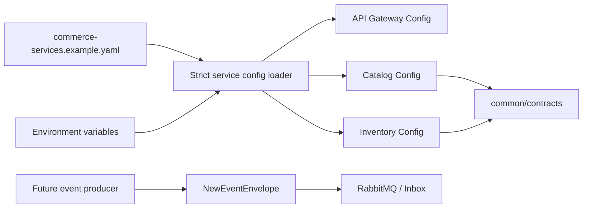

# 技术设计: 事件契约与按服务配置落地

## 技术方案

### 核心技术

- Go 标准库 `os.Expand`、`os.LookupEnv`、`net`、`path/filepath`。
- 现有 Viper 1.21 负责 YAML 解码和旧配置兼容，不新增配置框架。
- 现有 `common/contracts` 作为服务边界、事件类型和事件信封的唯一来源。

### 实现要点

1. 在事件信封注释中固定版本语义：`EventType` 含事件路由和主版本后缀，`EventVersion` 表示 Payload/信封演进版本；`Validate` 只要求正数，不增加未来版本上限。
2. 在 `events_test.go` 增加已知事件类型 `EventVersion=99`、已知事件类型与版本号不一致、未知事件类型未来版本的测试，防止后续消费者实现错误收紧契约。
3. 在 Catalog/Inventory 启动入口导入 `common/contracts`，启动前执行 `ValidateServiceBoundaries` 和 `ServiceBoundaryFor`；以后发布事件必须调用 `NewEventEnvelope`。
4. 新增按服务配置加载函数：读取文件、严格展开 `${VAR}`、使用 Viper 解码 `services` 和 `gateway` 节点、校验目标服务存在和必需字段，再映射为现有 `common/config.Config`。
5. `InitConfig` 在存在 `SECKILL_SERVICES_CONFIG` 时使用新加载器，并以 `catalog`、`inventory`、`gateway` 配置名确定运行角色；未设置时保持既有配置文件加载路径。
6. 使用 `common/contracts` 的服务名作为 Catalog、Inventory 默认发现键，并同步现有配置文件，避免 `catalog` 与 `catalog-service` 两套注册名并存。
7. 将边界依赖检查简化为直接查询完整边界目录，保持现有错误语义和所有权校验不变。

## 架构设计

## 架构决策 ADR

### ADR-001: EventType 与 EventVersion 独立演进

**上下文:** 事件类型字符串已经包含 `.v1` 主版本后缀，同时信封还包含 `EventVersion` 字段；如果强制两者数值一致，将阻断同一事件类型的向前兼容演进；如果完全不定义，消费者会出现不一致处理。

**决策:** `EventType` 是路由和主版本兼容边界，`EventVersion` 是 Payload/信封版本。信封层接受任意正的未来版本；具体消费者按自身支持版本决定处理、忽略或隔离，不在共享传输层拒绝未来版本。

**理由:** 保留事件路由稳定性和消费者独立升级能力，避免旧服务因未来版本事件无法读取信封而阻塞整个消息流。

**替代方案:** 强制 `EventType` 后缀与 `EventVersion` 一致 → 拒绝原因：同一事件主类型无法平滑演进 Payload；完全移除 `EventVersion` → 拒绝原因：无法表达 Payload/信封的独立演进。

**影响:** 后续 Inbox 消费者必须显式声明支持的事件版本；未知版本不能被当作已成功业务处理。

### ADR-002: 显式选择按服务配置，保留旧配置回退

**上下文:** 目标配置模板是 `services` map 结构，现有服务使用按进程的 Viper 文件和 `SECKILL_*` 覆盖，两者不能直接互相替代。

**决策:** 通过 `SECKILL_SERVICES_CONFIG` 显式启用统一模板；新加载器严格展开环境变量并映射到现有运行配置；未设置时继续使用旧文件，逐服务迁移。

**理由:** 让配置约定真正可运行，同时避免一次性改造所有尚未拆出的服务。

**替代方案:** 立即删除旧配置并全面替换 → 拒绝原因：当前 Identity/Order/Payment/Fulfillment 尚无对应入口，回归范围过大。

**影响:** 部署环境可逐步切换统一模板；缺失环境变量会在启动前失败，不会静默使用 `${VAR}` 字符串。

## 安全与性能

- 严格展开只读取环境变量，不打印变量值；缺失变量错误只包含变量名。
- 配置校验拒绝空服务名、空地址和未知服务角色；不允许 Gateway 从模板读取业务 DSN以外的跨服务数据库权限。
- 事件信封不解析业务 Payload，不改变现有消息性能；边界校验只在进程启动时执行一次。

## 测试与部署

- 单元测试：事件未来版本、版本独立演进、未知环境变量、服务选择、配置映射和边界校验。
- 质量检查：`go test ./...`、`go vet ./...`、`go test -race ./...`、`git diff --check`。
- 内存端到端：继续执行 `tests/e2e_memory.sh`；Docker daemon 不可用时跳过真实基础设施集成。
- 配置验收：用临时环境变量加载 `config/commerce-services.example.yaml`，不得输出真实密钥。
