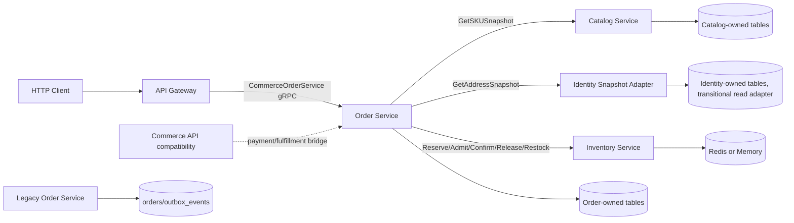
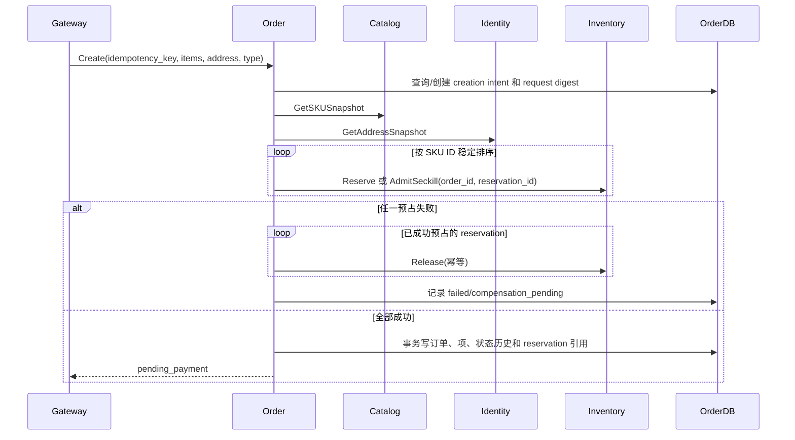

# 技术设计: 第三阶段唯一 Order Service 订单编排

## 技术方案

### 核心技术

- Go 1.25、gRPC、Protobuf、GORM、MySQL 8、etcd 服务发现。
- Catalog、Identity、Inventory 通过版本化 gRPC 契约提供同步能力；Order Service 不共享业务 Repository，不直接跨服务访问数据库。
- 订单创建和库存补偿采用本地持久化操作记录加幂等 gRPC；RabbitMQ Outbox/Inbox 延后至阶段 5。
- Memory Repository、Fake gRPC Client 和 bufconn 用于无 Docker 验收；MySQL/Redis/Compose 作为可用基础设施下的追加验收。

### 实现要点

1. 在 `internal/order` 建立独立的订单领域、应用服务、Repository、下游客户端和 gRPC 适配层；保留现有 `order_service/` 目录作为旧秒杀兼容服务，直到阶段 6 再收口。
2. Order Service 负责订单数据的唯一业务写入。`commerce_orders`、`order_items`、`order_status_history` 由 Order Repository 操作；`inventory_reservations` 由 Inventory Service 操作；价格、商品名称和地址均来自调用时快照，不在 Order 中读取 Catalog/Identity 表。
3. 订单 ID、库存预占 ID 和创建意图由 `(user_id, idempotency_key, request_digest)` 派生或持久化绑定，保证调用重试不会创建第二个预占，同时让不同幂等键的相同业务内容生成不同订单。创建请求需要保存规范化请求摘要，防止相同幂等键承载不同业务参数。
4. 普通订单调用 Inventory `Reserve`；秒杀订单调用一次带 `order_id` 绑定能力的 `AdmitSeckill` 或等价统一预占操作。Gateway 不再单独调用 `AdmitSeckill`，避免双重扣减。
5. 取消、超时、支付确认和后续履约状态操作均由 Order 状态机执行。Inventory 动作先以幂等操作完成，再提交订单状态；发生数据库或下游故障时由 `order_operations` 记录重试，不允许用“已写订单但库存未释放/确认”作为成功结果。
6. 当前 Identity 尚未独立运行时，增加只提供 `GetAddressSnapshot` 的兼容 gRPC 适配器。该适配器可使用现有身份数据或 Memory Fake，但 Order Service 永远只依赖 `IdentityService` 客户端接口。

## 架构设计

请求切换后的唯一写入路径为：`Gateway -> Order Service -> 下游 gRPC + OrderDB`。`commerce-api` 不再作为 `/api/v1/orders*` 的业务 Repository，旧 `Legacy Order Service` 只处理旧 `/order` 兼容接口。

## 架构决策 ADR

### ADR-011: Order Service 成为商城订单唯一写入者

**上下文:** 当前 Commerce API 已能写商城订单表，但目标架构要求订单、状态历史和订单项属于独立 Order Service；如果保留两个写入者，Gateway 切流和回退都会产生竞争写入。

**决策:** 将 `commerce_orders`、`order_items`、`order_status_history` 及订单创建/操作记录归属 Order Service。迁移期间保留表名和已有数据，禁止 Order 直接写 Catalog、Identity、Inventory 表；Commerce 的订单写入口在新链路启用后关闭，回退时也必须先执行单写者切换。

**理由:** 保持已有商城表和订单 ID 不变，减少数据复制和停机；通过代码边界而不是共享数据库实例表达服务所有权。

**替代方案:** 继续让 Commerce API 写表并由 Order Service 代理 → 拒绝原因: Order Service 只是转发层，无法真正形成数据所有权，后续 Payment/Fulfillment 拆分仍会继续跨写。

**影响:** 需要把 Commerce 中的订单状态操作改为 Order 客户端；需要切流开关、健康检查和旧入口拒写测试。

### ADR-012: 使用同步 gRPC 编排加本地可重试操作记录

**上下文:** 阶段 5 才会建立统一 Outbox/Inbox 和 RabbitMQ 消费者，而阶段 3 已经需要跨服务预占、释放和确认库存。

**决策:** 阶段 3 使用 Catalog/Identity/Inventory 的同步 gRPC，并在 OrderDB 中记录创建意图与 `order_operations`。所有外部命令使用稳定 ID 和有限 deadline；支付前释放、支付确认和退款后的 `Restock` 失败都进入待重试状态，由 Order Service worker 重试。RabbitMQ 不作为本阶段订单创建的隐式依赖。

**理由:** 可以在没有 Docker/RabbitMQ 时用 Fake 完成完整行为验收，同时把失败状态持久化，不依赖进程内 goroutine 保证最终处理。

**替代方案:** 本阶段立即改为 RabbitMQ 驱动订单创建 → 拒绝原因: 会把消息可靠投递、Inbox、DLQ 和订单编排同时引入，扩大变更面且无法在当前环境做真实集成验收。

**影响:** 阶段 3 的调用链是同步的，热点压力由 Inventory Redis Lua 和 Gateway 限流承担；阶段 5 需要把本地操作记录与 Outbox/Inbox 统一或迁移。

### ADR-013: Identity 使用地址快照 gRPC 兼容适配

**上下文:** 新 Identity proto 已定义 `GetAddressSnapshot`，但当前仓库没有可独立启动的 Identity Service。Order 如果直接读 `user_addresses`，会破坏服务边界；如果完全等待阶段 4，阶段 3 无法验收真实 Order 创建。

**决策:** 阶段 3 提供最小 Identity Snapshot Adapter，运行时实现只暴露地址快照 gRPC，数据源可以是现有身份存储；测试使用 Memory/Fake。Order 只依赖 gRPC 客户端。阶段 4 在相同服务名和契约上增加完整身份能力并接管数据所有权。

**理由:** 让阶段 3 形成真实的跨服务调用边界，并避免 Order 代码绑定过渡数据库。

**替代方案:** Order 直接访问 `user_addresses` → 拒绝原因: 形成跨服务表依赖，后续 Identity 拆分时会再次返工且无法证明边界有效。

**影响:** 适配器是阶段 3 的临时组件，必须有明确配置和下线记录；过渡期间身份表可能仍由 Commerce 维护，但 Order 不获得其 DSN。

### ADR-014: 秒杀只走一次 Inventory 预占并在预占时绑定订单

**上下文:** 当前 `AdmitSeckill` 会扣减库存并记录限购，Gateway 如果先调用它、Order 再调用 `Reserve`，会发生双重扣减；现有 admission 记录还需要可靠绑定订单。

**决策:** 扩展 Inventory 契约，使秒杀准入请求携带 Order ID，或新增语义等价的“带订单绑定的秒杀预占”操作；Order 对每个 SKU 只执行一个库存命令并保存返回的 reservation ID。普通订单使用 `Reserve`，秒杀订单使用一次带限购能力的 admission/reserve，取消和支付分别调用 `Release`/`Confirm`。

**理由:** 维持 Inventory 的 Redis Lua 原子库存和限购能力，同时让 Order 成为唯一编排者。

**替代方案:** 先由 Gateway 秒杀扣库存，再把已扣库存结果传给 Order → 拒绝原因: 业务编排分散在两个入口，重试、权限和补偿无法由 Order 统一保证。

**影响:** 需要兼容旧 `AdmitSeckill` 请求；新字段采用 Protobuf 向后兼容方式，旧接口只留给旧秒杀链路。

### ADR-015: 通过确定性创建意图处理跨服务重试

**上下文:** 如果库存预占成功后 Order 进程在写订单前崩溃，简单随机订单 ID 会在重试时产生新的 reservation，造成孤儿库存或重复扣减。

**决策:** 在 OrderDB 写入唯一的创建意图和请求摘要，提前分配稳定 Order ID；预占 ID 从 Order ID、SKU ID 和模式派生，并将每次外部动作写入操作记录。worker 扫描 `started/failed` 意图，校验载荷摘要后复用同一 ID 继续创建或补偿；创建意图同样限制为 8 次尝试。

**理由:** 不要求分布式事务，也不依赖消息队列即可恢复已发出的幂等命令；同一幂等键的参数冲突可以在本地被拒绝。

**替代方案:** 每次 HTTP/gRPC 重试生成新的随机订单 ID → 拒绝原因: 无法识别已发出的下游库存动作，容易产生孤儿 reservation。

**影响:** 增加少量 OrderDB 元数据和清理任务；迁移必须保留未完成意图的可追踪性。

## 服务边界与数据模型

### 数据所有权

| 数据集 | 唯一写入者 | Order Service 访问方式 |
|--------|------------|------------------------|
| `commerce_orders` | Order Service | 本地事务 Repository |
| `order_items` | Order Service | 本地事务 Repository，保存 SKU 快照和 reservation 引用 |
| `order_status_history` | Order Service | 本地事务 Repository |
| `order_create_intents` | Order Service | 创建幂等和恢复 |
| `order_operations` | Order Service | 补偿、重试和执行状态 |
| `inventory_reservations` | Inventory Service | `Reserve`/`AdmitSeckill`/`Confirm`/`Release`/`Restock` gRPC |
| `skus`、`spus` | Catalog Service | `GetSKUSnapshot` gRPC |
| `user_addresses` | Identity Service/阶段 3 适配器 | `GetAddressSnapshot` gRPC |
| 旧 `orders`、`outbox_events` | Legacy Order/Messaging | 旧兼容接口，不被新链路访问 |

### 迁移策略

1. 保留现有 `commerce_orders` 等表和历史数据，不复制到旧 `orders`，也不在 Order Service 启动时执行自动 `AutoMigrate`。
2. 新增版本化迁移，补充 `order_items.reservation_id`、创建意图、操作记录和必要索引；已有订单先以可回填/可为空方式兼容，再由后台校验报告不能恢复的历史记录。
3. 迁移脚本不得删除表、清空数据或修改旧秒杀表；订单服务启动前执行 schema 版本检查，缺少迁移时只进入 not-ready。
4. 新订单写入只经过 Order Repository。旧商城订单可以继续查询，但历史数据若缺少 reservation 引用，取消/支付等动作必须返回可观测的迁移错误，不得猜测并改写库存。

## API 设计

### `CommerceOrderService`

保持现有 `Create`、`Get` 的字段兼容，并以新增 RPC 表达明确的订单操作：

| RPC | 用途 | 关键约束 |
|-----|------|----------|
| `Create` | 普通/秒杀统一创建 | `idempotency_key`、用户、地址、订单类型和 SKU 列表必填；返回 `reused` |
| `Get` | 查询单个订单 | 服务端以已验证调用方身份过滤 `user_id` |
| `List` | 分页查询 | 只能查询当前用户，管理员查询需独立权限接口或明确角色 |
| `Cancel` | 用户取消 | 只允许 `pending_payment`，释放成功后转 `canceled` |
| `ConfirmPayment` | 支付过渡适配 | 支付回调幂等，确认全部 reservation 后转 `paid` |
| `Ship` | 管理员发货 | 仅 `paid`，校验 admin 角色 |
| `ConfirmReceipt` | 用户确认收货 | 仅 `shipped`，校验订单归属 |
| `Refund` | 退款过渡适配 | 仅允许合法状态；先 `Restock` 全部 confirmed reservation，再转 `refunded`，退款数据仍由过渡 Payment 组件维护 |

所有响应使用稳定状态和错误码；下游 timeout、库存不足、地址不存在、幂等冲突分别映射到可识别的 gRPC status，不向客户端透传 SQL、Redis 或内部地址。

### `InventoryService` 契约调整

- `InventoryReserveRequest` 增加可选 `activity_id` 或等价模式字段，由 Inventory 判断普通/秒杀语义。
- `InventorySeckillAdmitRequest` 增加 `order_id`，新 Order 链路使用稳定的 Order ID 发起一次准入；旧调用不受影响。
- response 必须返回稳定 reservation/admission ID 和状态；重复同参数请求返回原状态，不重复扣库存。
- 如契约最终采用独立 `BindReservation` RPC，必须保证绑定操作只改变 reservation 的订单归属，不改变库存数量和状态。

### 内部调用身份

Gateway 从 JWT 获取用户和角色，Order gRPC Client 使用内部签名 metadata 传递调用方、方法、时间戳和 nonce；Order Server 校验签名和时钟偏差，并将签名身份作为唯一用户来源。请求体中的 `user_id` 只用于兼容和一致性校验，不得覆盖签名身份。服务间密钥只从环境变量读取，不写入配置模板或日志。

## 创建与补偿流程

取消/超时执行同样的可重试释放流程；支付确认执行全部 `Confirm` 后再由 Order 状态机写 `paid`；退款执行全部 `Restock` 后再写 `refunded`。如果操作或创建意图处于 `pending_retry`/`failed`，后台 worker 按指数退避且设置最大重试次数，超过上限进入人工可查询状态，不循环轰炸下游。

## 切流、回退与运行配置

### 切流顺序

1. 执行 Order Service schema migration，检查历史订单和未完成创建意图。
2. 启动 Order Service、Identity Snapshot Adapter、Catalog 和 Inventory，执行 gRPC health/readiness 与 Fake E2E。
3. 关闭 `commerce-api` 的订单写入和订单超时 worker；保留回退配置但不允许其与 Order 同时启用。
4. Gateway 显式注册 `/api/v1/orders*` 和 `/api/v1/seckill/orders`，显式路由优先于 `NoRoute` Commerce 代理；秒杀请求只到 Order。
5. 观察订单创建、预占、补偿、状态转换和旧表写入指标，再扩大流量。

### 回退条件

只有在 Order Service 停止接收新写请求、处理完或标记完进行中的操作后，才能关闭 Order 路由并开启 Commerce 兼容写入。回退期间不能把已创建的新订单复制到旧 `orders`，也不能让旧兼容消费者更新 `commerce_orders`。

### 配置

- Order Service 消费 `SECKILL_SERVICES_CONFIG` 中 `services.order` 的独立地址、DSN、RabbitMQ 和 etcd 约定；本阶段 RabbitMQ 仅保留配置兼容，不建立消息依赖。
- Order 下游服务地址优先使用服务配置/etcd，测试可注入 direct address 或 bufconn；每个 gRPC 调用必须设置 deadline。
- Gateway 增加 Order Service 路由开关和回退模式；默认值必须明确，配置错误时拒绝启动或保持 not-ready，不能静默回到跨表 Commerce 写入。

## 安全与性能

- 地址快照属于 PII，不能写入普通业务日志；错误响应和 trace attributes 只记录 order ID、user ID 哈希或脱敏标识。
- 所有订单动作校验调用方归属和角色；管理员发货不能由普通用户伪造，直接 gRPC 请求缺少内部签名时拒绝。
- `Idempotency-Key` 长度、字符集、请求摘要、数量和金额边界必须在 Order Service 再校验，不能只依赖 Gateway。
- gRPC 设置连接复用、deadline、有限重试；只对明确幂等的 Inventory 和 Order 操作重试，禁止对随机创建请求无限重试。
- 多 SKU 预占按 SKU ID 排序，降低 Inventory/Redis 热点操作的锁竞争和死锁风险；每次补偿有上限并记录指标。
- 不执行生产数据库连接、清表、删除表或真实支付操作；迁移为向后兼容变更，Docker 不可用时使用 Memory/Fake 验收。

## 测试与部署

### 测试策略

- 领域单测：覆盖普通/秒杀相同状态机、非法状态转换、金额溢出、数量边界和重复状态操作。
- 应用服务单测：使用 Fake Catalog/Identity/Inventory 和 Memory Order Repository，覆盖幂等、请求摘要冲突、部分预占失败、补偿重试、取消/超时和权限。
- gRPC 合约测试：验证新增字段向后兼容、错误码映射、内部签名、deadline 和重复调用语义。
- Memory E2E：通过 bufconn 串联 Gateway、Order、Catalog、Inventory 和 Identity Fake，证明普通与秒杀订单不会双重扣库存，且旧表无写入。
- MySQL 验收：有 Docker 时执行 migration 重放、Repository 事务、唯一索引和并发创建；没有 Docker 时执行 SQL 解析、迁移静态校验和已有内存回归脚本。

### 部署与验收

- 代码必须通过 `gofmt`、`go test ./...`、`go vet ./...`、必要范围的 `go test -race ./...` 和 `git diff --check`。
- Docker daemon 可用时追加 MySQL/Redis/etcd Compose 健康检查和真实 gRPC E2E；不可用时明确记录跳过项，不把 Fake 结果描述成真实基础设施验收。
- 阶段完成标准是：新 API 路由全部由 Order gRPC 处理；新链路只写 Order 自有订单表；Inventory 只被调用一次完成预占；重复、失败、取消、超时和权限测试均通过；旧订单表仍可被旧兼容链路使用但新链路不写入。
