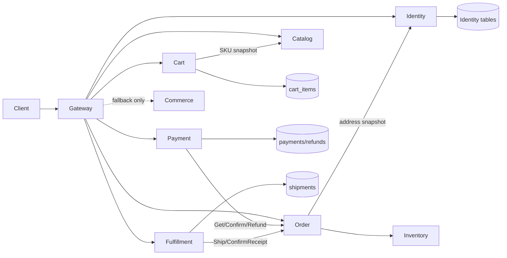

# 技术设计: 阶段 4 领域服务拆分

## 技术方案

### 核心技术
- Go、gRPC、Protobuf、Gin Gateway、GORM/MySQL、etcd 服务发现。
- `internal/platform/auth` 负责商城 JWT、bcrypt 和 Refresh Token。
- 通用内部 HMAC metadata 负责 Gateway/服务间身份、角色和重放窗口校验。
- Memory Repository、Fake Client 与 gRPC bufconn 负责无 Docker 验收。

### 实现要点

1. 扩展现有四份 proto，保持已有字段编号不变，只追加 RPC 和消息字段。
2. 四个服务分别定义领域模型和 Repository；MySQL 实现只能访问其所有权表，Memory 实现保证并发安全和幂等。
3. Identity Service 复用现有地址快照 RPC，并新增注册、登录、刷新和地址 CRUD。
4. Cart Service 通过 Catalog `GetSKUSnapshot` 获取实时商品快照，普通订单未提交 items 时由 Gateway 读取购物车。
5. Payment Service 通过 Order `Get/ConfirmPayment/Refund` 完成状态协作，Payment 表保存 `user_id` 以避免跨服务查询所有权。
6. Fulfillment Service 通过 Order `Ship/ConfirmReceipt` 完成状态协作，物流单据按 `order_id` 和运单号幂等。
7. Gateway 对阶段 4 路由使用商城 JWT 中间件和通用内部签名；旧 `/order` 继续使用旧 JWT。
8. Commerce 保留回退实现但不再承接 Gateway 的阶段 4 显式路由；RabbitMQ 事件化延后到阶段 5。

## 架构设计



## 架构决策 ADR

### ADR-016: 阶段 4 使用同步领域命令完成服务拆分
**上下文:** 阶段 5 才实现新商城 Outbox/Inbox 与 RabbitMQ；阶段 4 必须先建立清晰的数据所有权和独立进程。
**决策:** Payment 和 Fulfillment 通过幂等 gRPC 命令调用 Order，业务唯一键用于中断后重试收口。
**理由:** 将服务拆分风险与消息运行时风险分开，能够用 Memory/bufconn 独立验证。
**替代方案:** 同时接入 RabbitMQ → 拒绝原因: 故障面过大，无法判断问题来自服务边界还是消息一致性。
**影响:** 阶段 4 仍有短暂同步一致性窗口，阶段 5 需用 Outbox/Inbox 替换并保留兼容命令。

### ADR-017: Gateway 成为 `/api/v1` 唯一 HTTP 适配层
**上下文:** Commerce 的 Gin Router 仍包含完整 API，Gateway 通过 NoRoute 代理未切换能力。
**决策:** 阶段 4 路由在 Gateway 显式注册并调用 gRPC，Commerce 仅保留回退和旧进程级测试。
**理由:** 外部契约稳定且服务不会重复实现 HTTP/JWT 逻辑。
**替代方案:** 每个服务暴露独立 HTTP → 拒绝原因: 增加重复认证、错误映射和端口管理。
**影响:** Gateway 客户端和路由数量增加，需要统一超时、错误映射和内部签名。

### ADR-018: 商城 JWT 与旧秒杀 JWT 分离验证
**上下文:** 旧 JWT 不含 role/token_type，无法作为新商城管理员授权依据。
**决策:** `/api/v1` 目标服务路由验证 `seckill-commerce` issuer、`access` token_type 和 role；旧接口继续使用原 JWT 中间件。
**理由:** 防止无角色旧 Token 被提升为管理员，同时保持旧链路兼容。
**替代方案:** 扩展旧 Token 并全量迁移 → 拒绝原因: 会破坏旧兼容客户端。
**影响:** 测试和调用方必须使用 Identity 签发的商城 Access Token。

## API设计

### IdentityService
- `Register/Login/Refresh`: 返回 Access/Refresh Token、过期时间和用户摘要。
- `CreateAddress/UpdateAddress/DeleteAddress/ListAddresses`: 按 `user_id` 处理地址所有权。
- `GetAddressSnapshot`: 保持阶段 3 契约兼容。

### CartService
- `Set/Delete/List/Preview`: 所有命令携带 `user_id`，响应返回 SKU 快照、行小计和实时可售状态。

### PaymentService
- `Create`: 按用户和订单创建或返回已有 Mock 支付单及回调签名。
- `Callback`: 校验支付签名和 callback_ref，调用 Order 确认支付。
- `Refund`: 创建或返回已有退款单，调用 Order 完成退款。

### FulfillmentService
- `Ship`: 仅 admin 角色可调用，写物流单并调用 Order 发货。
- `ConfirmReceipt`: 仅订单用户可调用，更新物流并调用 Order 确认收货。
- `Get`: 查询订单物流摘要。

## 数据模型

```sql
ALTER TABLE payments ADD COLUMN user_id BIGINT UNSIGNED NOT NULL DEFAULT 0;
CREATE INDEX idx_payments_user ON payments(user_id, created_at);
```

阶段 4 不创建新商城消息表；现有领域表继续由 migration 管理，但运行时写入者变为对应服务。开发环境可共用 MySQL 实例，服务使用独立 DSN 配置且禁止跨表写入。

## 安全与性能

- `/api/v1` Access Token 校验 issuer、签名算法、过期时间、token_type、user_id 和 role。
- 内部 HMAC 覆盖完整 gRPC method、用户、角色和时间戳，允许时钟偏差不超过 30 秒。
- 密码、Refresh Token、地址详情、支付签名、DSN 和内部密钥不得写入日志。
- 所有 gRPC 调用设置 3 秒 deadline，服务端再次验证 user_id/role，不只信任 Gateway 请求体。
- Cart 批量按 SKU 稳定排序获取快照，数量和金额做上限与溢出校验。
- Payment callback_ref、payment_no、order_id，Refund order_id，Shipment order_id/运单号均有幂等唯一约束。

## 测试与部署

- 每个服务增加领域、Memory Repository、权限、幂等和 gRPC 测试。
- 使用一个 bufconn Server 串联 Gateway、Identity、Catalog、Cart、Order、Inventory、Payment 和 Fulfillment，覆盖注册到收货及退款分支。
- 运行 `go test ./...`、`go vet ./...`、`go test -race ./...`、`gofmt`、`git diff --check` 和 Compose 静态解析。
- Docker daemon 可用时追加 migration 重放、MySQL 所有权、Redis/etcd 和多进程 gRPC 验收；不可用时明确跳过。
- `commerce-api` 保留回退；切回前必须停止目标服务写入，禁止两套服务并发写相同领域表。
