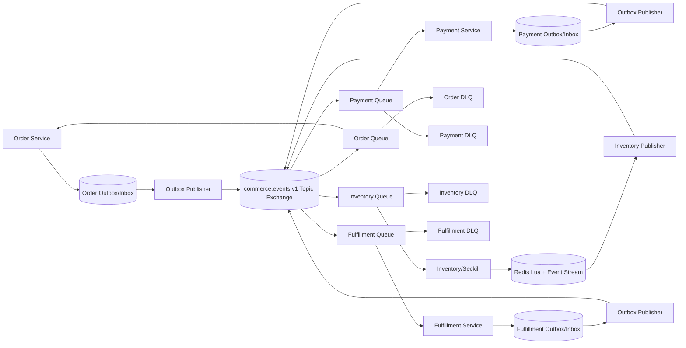

# 技术设计: 阶段5 Outbox/Inbox 与 RabbitMQ 可靠事件闭环

## 技术方案

### 核心技术

- Go 1.25、`github.com/rabbitmq/amqp091-go` 1.10、GORM/MySQL、Redis 7、OpenTelemetry 和 Prometheus。
- `common/contracts.EventEnvelope` 作为唯一事件正文格式；`common/messaging` 只负责传输、拓扑、发布确认、重试和消费循环。
- Order、Payment、Fulfillment 使用服务自有 MySQL Outbox/Inbox；Inventory 使用 Redis Lua + Stream 保存热点状态和事件日志的原子结果。

### 实现要点

1. 新增 `common/messaging` 包，定义 `OutboxStore`、`InboxStore`、`Broker`、`Publisher` 和 `Handler` 接口，并提供 RabbitMQ 实现与 Fake Broker。公共传输层不得导入领域服务包，不读取任意业务表。
2. RabbitMQ 使用持久化 Topic Exchange `commerce.events.v1`。每个消费者拥有独立主队列、重试队列和 DLQ，路由键使用 `EventType`，消费者之间不共享 Ack 状态。
3. Publisher 采用单连接/单 Channel 的 confirm 模式，开启 `mandatory`；等待 confirm 和 returned message 均受 context deadline 约束。网络断开后重建连接和 Channel，Outbox 仍保持 pending。
4. 消费者关闭 auto-ack，设置有限 Prefetch；成功处理后 Ack，业务错误进入带 TTL 的 retry queue，非法事件、未知类型、未来不支持版本和超过次数的毒丸消息进入 DLQ，禁止无限 `Nack(requeue=true)`。
5. 事件消费者先以 `(consumer, event_id)` 取得 Inbox 处理权；已完成记录直接 Ack，处理中记录按 lease 判断是否可恢复。业务处理必须调用现有幂等 Service/gRPC 命令，处理成功后写入 processed 状态再 Ack。
6. 对 MySQL 仓储增加事务内 Outbox 写入和 Memory/Fake 事件记录器。已有 `Repository` 接口保持可用，消息能力通过可选的事件扩展接口注入，未配置 MQ 时不启动消费者且阶段4同步路径继续工作。
7. Order 创建、取消和超时收口写入 `order.created.v1`/`order.cancelled.v1`；Payment 回调成功和退款单完成写入支付事件；Fulfillment 发货和收货写入物流事件；Inventory Reserve/Admit/Release/Restock 在状态转换成功时写事件。
8. 事件消费者的业务边界如下：Order 消费支付、库存和履约事件以完成状态恢复；Payment 消费订单创建/取消事件以维护支付可处理性；Inventory 消费取消/退款事件以执行 Release/Restock；Fulfillment 消费支付成功事件以维护待发货状态。重复事件只记录一次 Inbox，不重复修改业务状态。

## 架构设计



### RabbitMQ 拓扑

- 主交换机: `commerce.events.v1`，类型 `topic`，持久化。
- 重试交换机: `commerce.events.retry.v1`，按消费者建立 `commerce.<consumer>.retry` 队列；消息 TTL 到期后回到该消费者主队列。
- 死信交换机: `commerce.events.dlx.v1`，按消费者建立 `commerce.<consumer>.dlq` 队列；主队列拒绝或重试耗尽后进入 DLQ。
- 主队列: `commerce.order.events`、`commerce.payment.events`、`commerce.inventory.events`、`commerce.fulfillment.events`，分别绑定所需事件路由键。
- 消息属性: `content_type=application/json`、`delivery_mode=persistent`、`message_id=event_id`、`type=event_type`、`x-event-attempt` 和 OpenTelemetry headers。

### 事件路由

| 事件 | 发布者 | 消费者 | 处理目标 |
|---|---|---|---|
| `seckill.accepted.v1` | Inventory | Order | 记录/恢复秒杀准入对应订单，重复时不重复建单 |
| `order.created.v1` | Order | Payment | 记录订单可支付事实，服务重启后可重放 |
| `order.cancelled.v1` | Order | Payment、Inventory | 关闭待支付支付事实并释放预占库存 |
| `payment.succeeded.v1` | Payment | Order、Fulfillment | 确认订单支付和履约待处理状态 |
| `payment.refunded.v1` | Payment | Order、Inventory | 收敛退款状态并恢复已确认库存 |
| `inventory.reserved.v1` | Inventory | Order | 补齐库存预占事实 |
| `inventory.released.v1` | Inventory | Order | 收口取消/释放补偿 |
| `inventory.restocked.v1` | Inventory | Order | 区分退款恢复与支付前释放 |
| `shipment.created.v1` | Fulfillment | Order | 收口订单发货状态 |
| `shipment.delivered.v1` | Fulfillment | Order | 收口订单完成状态 |

## 架构决策 ADR

### ADR-005: 按服务保存本地 Outbox/Inbox

**上下文:** 旧 `outbox_worker` 读取共享旧表，不能保证新商城服务的数据所有权；跨服务事务会重新形成模块化单体。

**决策:** 每个发布者只写自己的 Outbox，每个消费者只写自己的 Inbox；公共包只提供接口和 RabbitMQ 运行时，领域服务负责在本地事务内追加事件。

**理由:** 保持服务边界、支持独立重试和故障隔离；即使发布确认丢失导致重复投递，也由消费者维度 Inbox 收敛。

**替代方案:** 一个集中式 Outbox/中继读取所有服务表 → 拒绝原因: 违反数据所有权并形成单点故障；继续扩展旧 Worker → 拒绝原因: 旧表模型和新商城订单状态机不兼容。

**影响:** 增加四类事件适配器、服务启动装配和 migration；阶段5完成后旧 Worker 仍可运行，阶段6再处理下线。

### ADR-006: Inventory 使用 Redis 原子事件日志

**上下文:** Inventory 的库存、限购和 reservation 状态由 Redis Lua 原子维护，若先改 Redis 再写 MySQL Outbox，会产生无法补发的窗口。

**决策:** Redis Lua 状态转换成功时同步 `XADD` 到 Inventory Outbox Stream；发布者用 Consumer Group 读取并在 RabbitMQ confirm 成功后 Ack Stream，失败消息由 pending claim 和有限退避恢复。

**理由:** 让秒杀准入与事件记录共享 Redis 原子边界，不把热点路径引入跨数据库事务。

**替代方案:** 仅在 gRPC 返回后异步写 MySQL Outbox → 拒绝原因: 进程宕机会丢失准入/释放事件；为 Inventory 强制增加 MySQL 事务 → 拒绝原因: Redis 库存变更无法与 MySQL 原子提交。

**影响:** Inventory Outbox 不使用 SQL 表，而使用受控 Redis key/Stream；必须限制 payload 大小、设置 pending 监控并提供 Stream 重放入口。

## API设计

本阶段不新增公网 HTTP 或 gRPC 方法。新增内部消息运行时配置：

- `SECKILL_MQ_URL` 或按服务配置中的 `<SERVICE>_RABBITMQ_URL`：RabbitMQ 连接地址。
- `SECKILL_MQ_ENABLED`：是否启动新商城消息运行时，未配置 MQ 时默认关闭。
- `SECKILL_MQ_MAX_RETRIES`：单消息最大重试次数，默认 5，限制在 1-20。
- `SECKILL_MQ_RETRY_DELAY`：首个 retry queue TTL，默认 1s，必须为正数。
- `SECKILL_MQ_CONSUMER`：事件 Worker/测试指定消费者名称。

## 数据模型

SQL Outbox/Inbox 逻辑结构如下，实际表按服务前缀拆分：

```sql
CREATE TABLE <service>_outbox_events (
    id BIGINT UNSIGNED PRIMARY KEY AUTO_INCREMENT,
    event_id VARCHAR(128) NOT NULL,
    aggregate_type VARCHAR(64) NOT NULL,
    aggregate_id VARCHAR(128) NOT NULL,
    event_type VARCHAR(128) NOT NULL,
    event_version INT NOT NULL,
    payload JSON NOT NULL,
    headers JSON NULL,
    status VARCHAR(32) NOT NULL DEFAULT 'pending',
    attempts INT NOT NULL DEFAULT 0,
    next_retry_at DATETIME NOT NULL DEFAULT CURRENT_TIMESTAMP,
    last_error VARCHAR(255) NOT NULL DEFAULT '',
    created_at DATETIME NOT NULL DEFAULT CURRENT_TIMESTAMP,
    updated_at DATETIME NOT NULL DEFAULT CURRENT_TIMESTAMP ON UPDATE CURRENT_TIMESTAMP,
    UNIQUE KEY uk_<service>_outbox_event (event_id),
    KEY idx_<service>_outbox_pending (status, next_retry_at)
);

CREATE TABLE <service>_inbox_events (
    id BIGINT UNSIGNED PRIMARY KEY AUTO_INCREMENT,
    consumer VARCHAR(128) NOT NULL,
    event_id VARCHAR(128) NOT NULL,
    event_type VARCHAR(128) NOT NULL,
    event_version INT NOT NULL,
    status VARCHAR(32) NOT NULL DEFAULT 'processing',
    attempts INT NOT NULL DEFAULT 0,
    last_error VARCHAR(255) NOT NULL DEFAULT '',
    processed_at DATETIME NULL,
    created_at DATETIME NOT NULL DEFAULT CURRENT_TIMESTAMP,
    updated_at DATETIME NOT NULL DEFAULT CURRENT_TIMESTAMP ON UPDATE CURRENT_TIMESTAMP,
    UNIQUE KEY uk_<service>_inbox_consumer_event (consumer, event_id)
);
```

Outbox payload 保存完整 `EventEnvelope.Payload`，`event_id` 必须稳定且由业务聚合/动作组成；Inbox 不保存敏感原文，只保存路由信息、处理状态和错误摘要。

## 安全与性能

- 不将 RabbitMQ 凭据写入仓库、事件 payload 或日志；Compose 继续从环境变量注入。
- 所有消费者调用 gRPC 时设置 deadline，内部调用继续使用现有 HMAC 认证；消息 headers 只传播 trace context，不传播用户 Token。
- Outbox claim 使用批量查询和短事务，MySQL 环境使用行锁避免同一服务多个 Publisher 重复领取；发布确认等待受超时保护。
- 消费者设置 Prefetch，失败不无限 requeue；retry/DLQ 按消费者隔离，避免一个毒丸消息阻塞其他领域。
- 指标至少覆盖 Outbox pending、publish success/failure/confirm nack、consumer ack/nack、Inbox duplicate、retry、DLQ 和 compensation；标签使用固定服务/事件/结果集合，避免高基数。
- 事件处理只依赖业务 ID和状态检查，重复 Release/Restock/Confirm/Transition 必须保持现有幂等行为。

## 测试与部署

- 单元测试覆盖事件信封序列化、路由拓扑、Publisher Confirm/mandatory、重试退避、Inbox 唯一键、重复 Ack 和未来版本隔离。
- Memory/Fake E2E 覆盖秒杀准入、创建订单、支付成功、取消释放、发货收货、退款恢复和重复事件；Fake Broker 支持投递、断连、重复和重放注入。
- MySQL 测试覆盖本地事务回滚时 Outbox 不产生、提交后只产生一次、重复 event_id 唯一约束和 Inbox 并发争抢。
- RabbitMQ 集成测试由 `SECKILL_RABBITMQ_INTEGRATION=1` 控制，验证 confirm、主队列重试、手动 Ack、DLQ、消费者重启和恢复后重放；不可用时保留跳过原因。
- 更新 migration、Compose 中的新商城 RabbitMQ 配置和事件 Worker/消费者启动入口；旧 `outbox-worker`、`mq-consumer`、`dlq-consumer` 不接入新 Topic。
