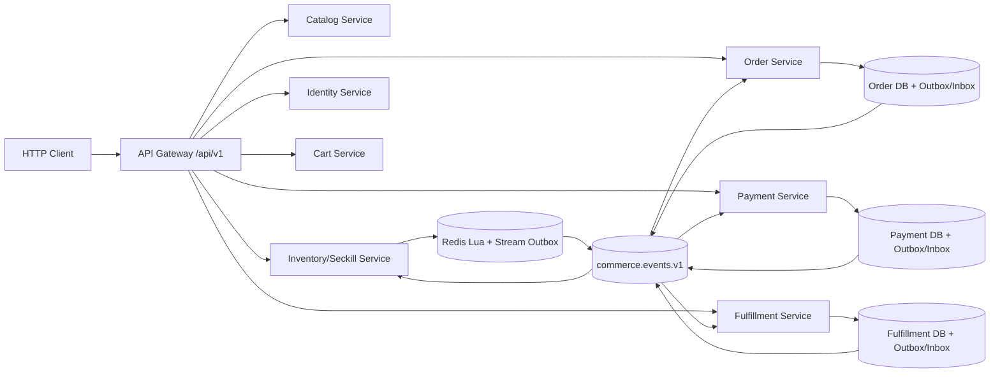

# 技术设计: 统一商城架构与阶段5可靠消息闭环

## 技术方案

### 核心技术

- Go 1.25、gRPC、`github.com/rabbitmq/amqp091-go` 1.10、GORM/MySQL、Redis 7、OpenTelemetry 和 Prometheus。
- 新商城服务使用统一 `common/contracts.EventEnvelope`；`common/messaging` 提供 RabbitMQ transport、Fake Broker、Outbox/Inbox 接口、重试和 DLQ。
- Order、Payment、Fulfillment 使用自有 SQL Outbox/Inbox；Inventory 使用 Redis Lua + Stream；不再保留旧 `outbox_events` 事件协议。

### 实现要点

1. 公共消息包只依赖事件契约和 AMQP，不导入任何领域服务或旧表模型；领域服务通过适配器提供本地 Outbox/Inbox 存储。
2. RabbitMQ 使用持久化 Topic Exchange `commerce.events.v1`，按 Order、Payment、Inventory、Fulfillment 建立独立主队列、retry queue 和 DLQ。
3. Publisher 开启 confirm 和 mandatory，等待 confirm/returned message 受 context deadline 约束；连接断开时重建 Channel，Outbox 保持 pending。
4. Consumer 使用手动 Ack 和有限 Prefetch；处理成功并完成 Inbox 后 Ack，可恢复错误进入 retry，非法/未知/不支持版本进入 DLQ，禁止无限 requeue。
5. 事件消费者调用现有幂等 Service/gRPC 命令，不直接跨服务写表；同步 gRPC 仍是外部命令入口，消息用于可靠通知、补偿和状态恢复。
6. 未配置 MQ 时服务仍可使用 Memory/Fake 运行，但统一事件记录器保持可测试；生产/Compose 配置开启消息运行时后，四个目标服务各自启动 Publisher/Consumer。
7. 统一事件包括 `seckill.accepted.v1`、`order.created.v1`、`order.cancelled.v1`、`payment.succeeded.v1`、`payment.refunded.v1`、`inventory.reserved.v1`、`inventory.released.v1`、新增 `inventory.restocked.v1`、`shipment.created.v1` 和 `shipment.delivered.v1`。

## 架构设计



### 统一运行时边界

- Gateway 不再注册 `registerCommerceProxy`，不再连接 `product`、旧 `order`，也不再读取 `commerce_url`。
- Compose 只启动 Catalog、Inventory、Identity、Cart、Order、Payment、Fulfillment、Gateway、migration、MySQL、Redis、RabbitMQ、etcd、Jaeger 和监控组件。
- `cmd/commerce-api`、`order_service`、`product_service`、`mq_consumer`、`outbox_worker`、`dlq_consumer` 不再参与编译/镜像/Compose；若无其他引用则删除其源文件和旧 protobuf 生成代码。
- 旧表只作为历史残留，不被新服务和消息运行时读取；新 migration 只创建新服务拥有的 Outbox/Inbox 表。

### RabbitMQ 拓扑

- 主交换机: `commerce.events.v1`，类型 `topic`，durable。
- Retry 交换机: `commerce.events.retry.v1`，每个消费者独立 TTL 队列，消息过期后回到对应主队列。
- DLQ 交换机: `commerce.events.dlx.v1`，每个消费者独立 DLQ；超过最大重试或不可恢复错误不再 requeue。
- 主队列: `commerce.order.events`、`commerce.payment.events`、`commerce.inventory.events`、`commerce.fulfillment.events`。
- AMQP 属性: `message_id=event_id`、`type=event_type`、`content_type=application/json`、`delivery_mode=persistent`、`x-event-attempt` 和 trace headers。

### 事件路由和处理

| 事件 | 发布者 | 消费者 | 处理目标 |
|---|---|---|---|
| `seckill.accepted.v1` | Inventory | Order | 记录/恢复秒杀准入事实，不重复建单 |
| `order.created.v1` | Order | Payment | 建立可支付事实，支持服务重启恢复 |
| `order.cancelled.v1` | Order | Payment、Inventory | 关闭待支付事实并释放 reservation |
| `payment.succeeded.v1` | Payment | Order、Fulfillment | 确认支付并恢复履约待处理状态 |
| `payment.refunded.v1` | Payment | Order、Inventory | 收敛退款并执行已确认库存恢复 |
| `inventory.reserved.v1` | Inventory | Order | 补齐预占事实 |
| `inventory.released.v1` | Inventory | Order | 收口取消和释放补偿 |
| `inventory.restocked.v1` | Inventory | Order | 区分退款恢复和支付前释放 |
| `shipment.created.v1` | Fulfillment | Order | 收口订单发货 |
| `shipment.delivered.v1` | Fulfillment | Order | 收口订单完成 |

## 架构决策 ADR

### ADR-005: 统一新商城为唯一运行时

**上下文:** 当前新旧链路并存，但没有外部系统依赖旧队列；保留旧链路会继续产生两套订单、库存和事件真源。

**决策:** 直接移除旧 `/order`/`/product` 入口、Commerce NoRoute 代理、旧 Product/Legacy Order 及旧 MQ Worker；所有新业务只通过 `/api/v1` 和目标微服务完成。

**理由:** 消除双写、双协议和双状态机，降低维护成本，保证演示和生产架构只有一个可解释的业务路径。

**替代方案:** 保留旧入口作为薄适配层 → 拒绝原因: 用户明确不需要兼容，且会延长旧语义生命周期；新旧运行时并行 → 拒绝原因: 无外部收益但增加故障排查和数据一致性成本。

**影响:** 旧路径变为 404；需要删除旧服务镜像和测试，更新 Compose、README、配置及数据说明；旧表不在本阶段物理删除。

### ADR-006: 按服务保存 Outbox/Inbox

**上下文:** 消息需要可靠发布和消费幂等，但不能以集中 Worker 读取所有服务表的方式恢复旧耦合。

**决策:** Order、Payment、Fulfillment 只写自有 SQL Outbox/Inbox；Inventory 在 Redis Lua 中原子写 Stream Outbox，并由本服务运行时发布。

**理由:** 保持数据所有权和故障隔离；发布重复由消费者 `(consumer,event_id)` 幂等键收敛。

**替代方案:** 集中式共享 Outbox → 拒绝原因: 违反服务边界；跨服务分布式事务 → 拒绝原因: MySQL/Redis/RabbitMQ 无共同事务协调。

**影响:** 增加消息适配器和每个服务的启动装配，但不引入跨服务数据库访问。

### ADR-007: 旧表只停用不删除

**上下文:** 仓库已有 `orders`、`product`、`outbox_events` 等表，直接 DROP/TRUNCATE 属于不可逆数据操作。

**决策:** 新代码和新 migration 不再访问旧表；本阶段只移除运行时和初始化依赖，物理表清理另行备份、审批和迁移。

**理由:** 统一运行时不需要兼容旧表，同时避免在当前环境无备份时造成数据损失。

**替代方案:** 阶段5直接删除旧表 → 拒绝原因: 破坏性且无法验证历史数据是否仍需保留。

**影响:** 一段时间内数据库仍可能存在未使用表，文档必须明确其历史状态。

## API设计

保留现有 `/api/v1` API，不新增公网接口；移除以下旧入口：

- `GET /order/:order_id`
- `POST /order`
- `GET /product/:id`
- Gateway 的 Commerce NoRoute 代理

旧路径统一由 Gateway 返回 404，不访问任何旧服务。

## 数据模型

新增 SQL Outbox/Inbox 表使用服务前缀：

```sql
CREATE TABLE <service>_outbox_events (
    id BIGINT UNSIGNED PRIMARY KEY AUTO_INCREMENT,
    event_id VARCHAR(128) NOT NULL,
    aggregate_type VARCHAR(64) NOT NULL,
    aggregate_id VARCHAR(128) NOT NULL,
    event_type VARCHAR(128) NOT NULL,
    event_version INT NOT NULL,
    payload JSON NOT NULL,
    headers JSON NULL,
    status VARCHAR(32) NOT NULL DEFAULT 'pending',
    attempts INT NOT NULL DEFAULT 0,
    next_retry_at DATETIME NOT NULL DEFAULT CURRENT_TIMESTAMP,
    last_error VARCHAR(255) NOT NULL DEFAULT '',
    created_at DATETIME NOT NULL DEFAULT CURRENT_TIMESTAMP,
    updated_at DATETIME NOT NULL DEFAULT CURRENT_TIMESTAMP ON UPDATE CURRENT_TIMESTAMP,
    UNIQUE KEY uk_<service>_outbox_event (event_id),
    KEY idx_<service>_outbox_pending (status, next_retry_at)
);

CREATE TABLE <service>_inbox_events (
    id BIGINT UNSIGNED PRIMARY KEY AUTO_INCREMENT,
    consumer VARCHAR(128) NOT NULL,
    event_id VARCHAR(128) NOT NULL,
    event_type VARCHAR(128) NOT NULL,
    event_version INT NOT NULL,
    status VARCHAR(32) NOT NULL DEFAULT 'processing',
    attempts INT NOT NULL DEFAULT 0,
    last_error VARCHAR(255) NOT NULL DEFAULT '',
    processed_at DATETIME NULL,
    created_at DATETIME NOT NULL DEFAULT CURRENT_TIMESTAMP,
    updated_at DATETIME NOT NULL DEFAULT CURRENT_TIMESTAMP ON UPDATE CURRENT_TIMESTAMP,
    UNIQUE KEY uk_<service>_inbox_consumer_event (consumer, event_id)
);
```

Inventory Stream 使用 `inventory:events` 及 `inventory-publisher` consumer group；出站 pending 事件由本服务桥接到 RabbitMQ，发布成功后 Ack，失败时通过 pending claim 重放。入站 Inbox 使用 `inventory:inbox:<consumer>:<event_id>` 原子租约键并保留已处理标记。

## 安全与性能

- RabbitMQ 凭据只从环境变量或服务配置展开，不写入事件、日志和方案文件示例中的真实值。
- 所有消费者调用 gRPC 带 deadline，内部 HMAC 认证保持不变；事件 headers 只传 trace context。
- Outbox 批量 claim 使用短事务和索引；Publisher confirm 有超时；消费者 Prefetch 防止单服务被未确认消息撑满。
- 不可恢复消息不无限 requeue；retry/DLQ 按消费者隔离；指标标签不包含 event_id、order_id 等高基数字段。
- Gateway 删除旧路由后，旧请求立即 404，避免误触发旧库存扣减；新订单和秒杀继续由 Order/Inventory 的幂等状态机处理。

## 测试与部署

- 运行 `go test ./...`、`go vet ./...`、目标包 `go test -race` 和格式检查；增加路由断言确保旧路径 404、目标 `/api/v1` 正常。
- Fake Broker/Memory E2E 覆盖注册、商品、普通/秒杀下单、支付、取消、发货、收货、退款、重复事件和重放。
- SQL 测试覆盖事务回滚、Outbox 唯一键、Inbox 并发唯一约束；Redis Lua 测试覆盖状态和 Stream 原子写入。
- Docker 可用时由 `SECKILL_RABBITMQ_INTEGRATION=1` 执行 RabbitMQ confirm、retry、手动 Ack、DLQ、重启和重放；不可用时记录跳过原因。
- Compose 只构建新服务；migration 保留历史旧表但不再创建旧运行时依赖；完成后更新 CHANGELOG、知识库并迁移方案包。
