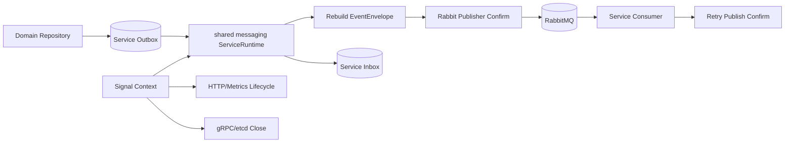

# 技术设计: 项目质量加固与重复收敛

## 技术方案

### 核心技术
- Go 标准库 `context`、`net/http`、`errors.Join`
- 现有 `gorm`、`amqp091-go`、Gin、gRPC 与 Prometheus 依赖
- 现有 `shared/contracts.EventEnvelope` 和 `shared/platform/messaging` 边界

### 方案对比

#### 方案一: 高置信度修复与平台收敛（采用）
- 修复已证实的消息正确性缺陷，同时提取消息/HTTP 生命周期公共能力。
- 不改业务 API、Protobuf、数据库表和领域状态机。
- 优点是能覆盖实现、结构和冗余三类目标，回归边界清晰；缺点是涉及多个服务入口。

#### 方案二: 仅修复 Outbox 缺陷
- 只修改 Outbox 解码和测试，改动最小。
- 无法处理 retry 可靠性、资源生命周期和三处重复运行时，未完整满足本轮审计目标，因此不采用。

#### 方案三: 全面拆分大型领域文件和服务入口
- 进一步拆分 Order Service、RabbitMQ transport 和全部 Repository 工厂。
- 文件迁移多、与当前未提交注释改动重叠大，行为收益不足且回归成本高，因此不采用。

### 实现要点
1. 为 `OutboxEvent` 提供信封重建函数：优先兼容完整信封 JSON，常规路径使用记录元数据、业务 payload 和稳定时间字段组装 `EventEnvelope`。
2. `publishOutboxBatch` 只处理重建并校验成功的事件；解码失败保留现有 failed 语义。
3. SQL claim 返回与数据库已写入一致的 `status/attempts/lease`；Memory claim 先全量排序再按 limit 选择，并复制可变 headers。
4. Consumer channel 开启 confirm；retry 使用 deferred confirm，确认失败时 Nack 原 delivery，确认成功后才 Ack。
5. 新增服务级消息运行时，统一 Memory/SQL store、Publisher、Outbox worker、Consumer 和 Close；业务入口只保留 Repository 类型选择与 Handler 创建。
6. 新增可复用 HTTP serve/shutdown 与 metrics 启动函数；Gateway 使用 signal context，并在退出时按逆序关闭客户端资源。
7. 移除统一 Gateway 配置中未使用的 debug login 过期时间字段，更新已过时注释和样例。

## 架构设计

## 架构决策 ADR

### ADR-009: Outbox 存储业务 payload，发布时重建稳定信封
**上下文:** 现有表把事件元数据拆列、`payload` 保存业务 JSON，但 worker 错按完整信封解码；直接改表或覆写历史 payload 会引入兼容风险。

**决策:** 保持数据表不变，由 `OutboxEvent` 使用分离字段重建 `EventEnvelope`；同时兼容 payload 已是完整信封的记录。缺失独立发生时间的历史 SQL 记录使用 `created_at` 作为稳定回退。

**理由:** 无 migration、兼容已有数据、与当前字段所有权一致，并能立即恢复发布链路。

**替代方案:** 把完整信封写入 `payload` → 拒绝原因: 改变存储契约且旧记录仍需兼容；新增 `occurred_at` migration → 拒绝原因: 本轮无需用数据库变更解决该缺陷。

**影响:** 新写入与历史记录均可发布；SQL 历史记录的 `occurred_at` 精度以 Outbox 创建时间为准。

### ADR-010: 服务级消息运行时归属共享平台层
**上下文:** Order、Payment、Fulfillment 完全复制 Store/Publisher/worker 装配，但事件 Handler 和 Repository 仍应由服务拥有。

**决策:** `shared/platform/messaging` 只抽取传输与生命周期运行时；服务继续负责 Repository 类型选择、表名和业务 Handler。

**理由:** 删除机械重复，同时不让共享层依赖任何业务服务或领域模型。

**替代方案:** 把业务 Repository 工厂也迁入共享层 → 拒绝原因: 会破坏服务自治并形成平台层反向业务依赖。

**影响:** 三个入口变短；新增服务可复用同一运行时，边界脚本规则保持成立。

## 安全与性能
- **安全:** 不输出 DSN、MQ URL、JWT 或内部签名密钥；关闭逻辑只作用于本进程创建的连接；不执行生产连接或破坏性操作。
- **可靠性:** retry 发布等待 broker confirm；Outbox 旧记录兼容，失败仍保留有限重试与 DLQ。
- **性能:** Memory claim 从随机截断改为排序全部候选，测试/本地数据量小；SQL 热路径不增加查询；消息运行时不增加额外 goroutine 数量。
- **资源:** HTTP shutdown 使用有限超时，超时后关闭 listener，避免进程无限等待。

## 测试与部署
- **单元测试:** Outbox 信封重建、legacy/full payload、Memory claim 顺序与 headers 隔离、SQL claimed-record 计数、消息运行时启停、HTTP shutdown、Gateway closers。
- **静态检查:** `gofmt`、边界脚本、`go vet`、`git diff --check`。
- **回归:** `go test -race -count=1 ./...`、`make check`。
- **集成:** Docker/RabbitMQ 可用时执行 `SECKILL_RABBITMQ_INTEGRATION=1 bash tests/stage5_rabbitmq_e2e.sh`；不可用时明确记录未验证项。
- **部署:** 无配置键、端口、API 或数据库迁移变化，可按现有服务逐个发布。
