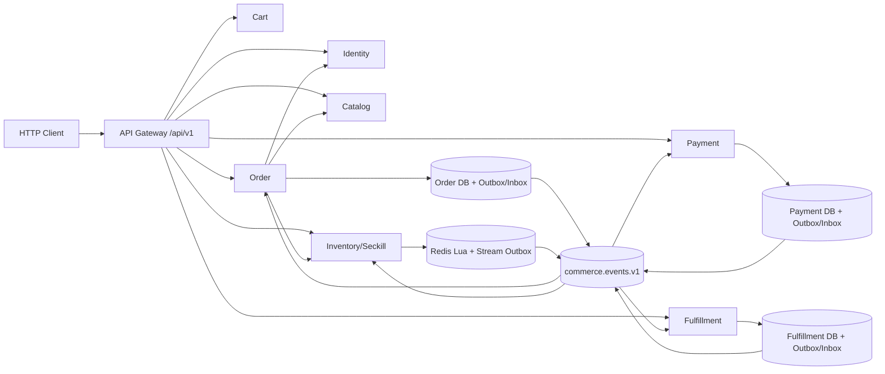

# 架构设计

## 总体架构

## 运行边界
- Gateway 只建立目标服务 gRPC 客户端，显式注册 `/api/v1` 路由；未注册路径返回 404。
- Order、Payment、Fulfillment 的领域状态和事件写入各自数据库事务；Inventory 状态和 Stream Outbox 在同一 Redis Lua 脚本中完成。
- RabbitMQ 由服务自身发布和消费，不存在集中旧 Worker；服务队列、retry 和 DLQ 按消费者隔离。
- 旧服务代码、旧 HTTP 入口和旧消息 Worker 已从构建/Compose 移除；旧数据库表不删除，仅停止读写。

## 事件路由

| 事件 | 发布者 | 消费者 |
|------|--------|--------|
| `seckill.accepted.v1` | Inventory | Order |
| `order.created.v1` | Order | Payment |
| `order.cancelled.v1` | Order | Payment、Inventory |
| `payment.succeeded.v1` | Payment | Order、Fulfillment |
| `payment.refunded.v1` | Payment | Order、Inventory |
| `inventory.reserved.v1` | Inventory | Order |
| `inventory.released.v1` | Inventory | Order |
| `inventory.restocked.v1` | Inventory | Order |
| `shipment.created.v1` | Fulfillment | Order |
| `shipment.delivered.v1` | Fulfillment | Order |

## 可靠性
- Outbox Publisher 使用持久消息、Publisher Confirm、mandatory return、批量 claim 和退避。
- Consumer 使用手动 Ack；业务处理成功且 Inbox 标记 processed 后才 Ack。
- 未知事件和未来版本安全隔离；可恢复错误进入 retry，超过上限进入 DLQ。
- 业务状态机与确定性 ID 共同保证同步 gRPC 与异步事件重复执行不产生重复事实。

## 重大架构决策

| ADR | 决策 | 日期 | 状态 |
|-----|------|------|------|
| ADR-001 | 统一新商城为唯一运行时，旧入口返回 404 | 2026-08-06 | ✅采纳 |
| ADR-002 | 按服务保存 Outbox/Inbox，Inventory 使用 Redis Stream | 2026-08-06 | ✅采纳 |
| ADR-003 | 旧表只停用不删除 | 2026-08-06 | ✅采纳 |

详细设计见 `helloagents/history/2026-08/202608061551_unified_stage5_messaging/how.md`。
