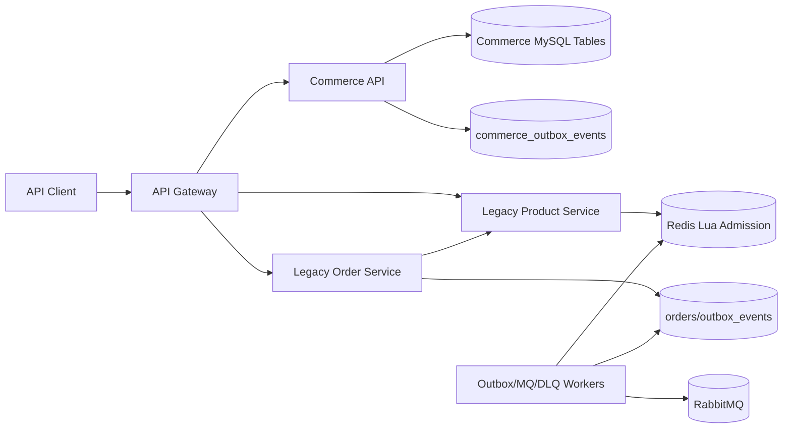
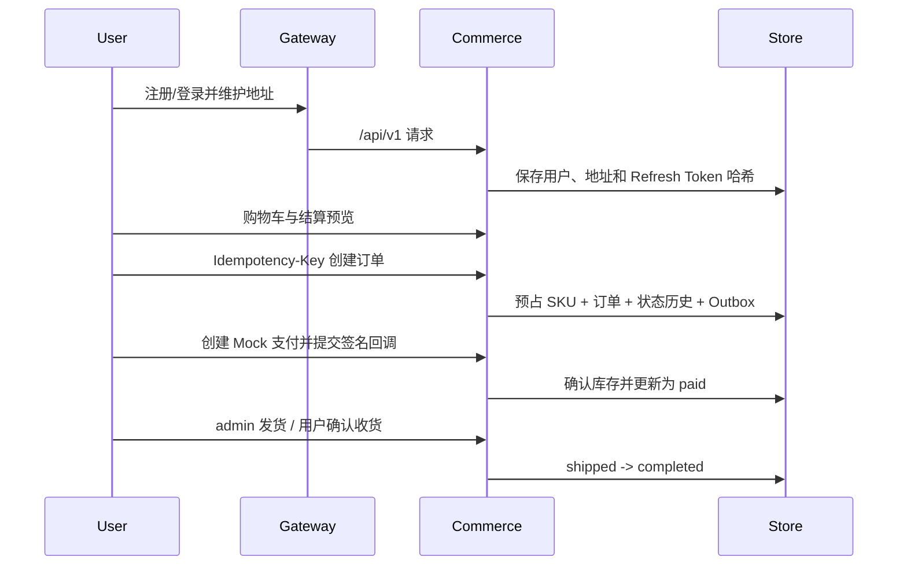

# 架构设计

## 总体架构

## 架构形态
- **新商城域:** `commerce-api` 是模块化服务，内部通过 Repository 接口隔离 HTTP、应用编排与 MySQL/内存存储。
- **旧秒杀域:** Product、Order 和消息 Worker 保持原有 gRPC、Redis Lua、RabbitMQ 链路，作为兼容系统继续运行。
- **数据隔离:** 新域使用 `users`、`skus`、`commerce_orders` 等表；旧域使用 `product`、`orders`、`outbox_events`，两条链路不跨写。
- **部署:** Gateway 将 `/api/v1/*` 反向代理到 Commerce API，旧路径继续走 gRPC 服务。

## 商城核心流程

## 一致性与状态
- 创建订单、库存预占、状态历史和 Outbox 在同一 MySQL 事务提交。
- 支付成功确认预占库存；待支付取消或超时释放库存；已支付未发货退款恢复库存。
- 订单和支付重复请求分别由 `(user_id, idempotency_key)`、`callback_ref` 和状态机保证幂等。
- Commerce Outbox 已持久化版本化事件，Inbox 表已建模；发布器和领域消费者尚未接入，因此当前业务动作仍在 Commerce 本地事务中同步完成。

## 已知边界
- 当前环境未完成真实 MySQL migration 重放和完整 Compose 健康检查，已用内存 E2E、SQL 解析和 Compose 配置校验替代。
- `/api/v1/seckill/orders` 进入统一商城状态机并使用 MySQL 条件库存预占，但尚未复用旧 Redis Lua 准入与旧 MQ 消费链路。
- 旧 MQ Consumer 仍跨写旧 `orders` 与 `product` 表；该行为被限制在兼容域，不属于新商城数据所有权模型。
- 前端明确暂缓，OpenAPI 是当前客户端契约。

## 重大架构决策

完整 ADR 存储在已归档方案的 `how.md` 中。

| adr_id | title | date | status | affected_modules | details |
|--------|-------|------|--------|------------------|---------|
| ADR-001 | 采用增量式受控微服务 | 2026-08-05 | ✅已采纳 | Gateway、Commerce、Legacy Services | [详情](../history/2026-08/202608051526_backend_commerce_mvp/how.md#adr-001-采用增量式受控微服务) |
| ADR-002 | 同一 MySQL 实例内实施领域数据所有权 | 2026-08-05 | ✅已采纳 | Commerce、Product、Order | [详情](../history/2026-08/202608051526_backend_commerce_mvp/how.md#adr-002-同一-mysql-实例内实施领域数据所有权) |
| ADR-003 | 金额使用最小货币单位整数 | 2026-08-05 | ✅已采纳 | Commerce API、Trade | [详情](../history/2026-08/202608051526_backend_commerce_mvp/how.md#adr-003-金额使用最小货币单位整数) |
| ADR-004 | 本地事务加 Outbox/Inbox | 2026-08-05 | ✅已采纳 | Commerce、Messaging | [详情](../history/2026-08/202608051526_backend_commerce_mvp/how.md#adr-004-本地事务加-outboxinbox) |
