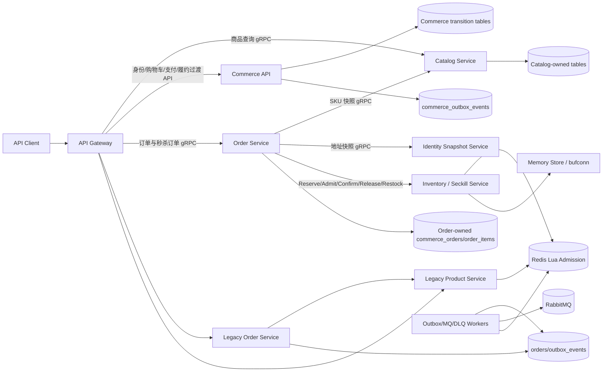
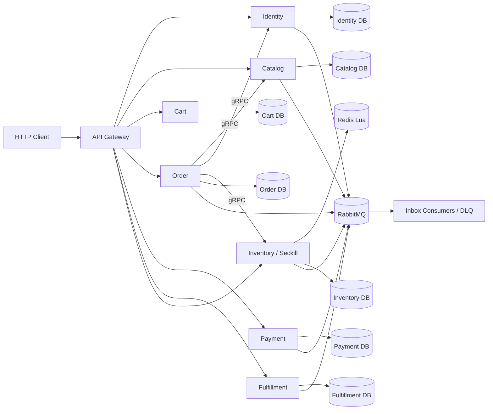
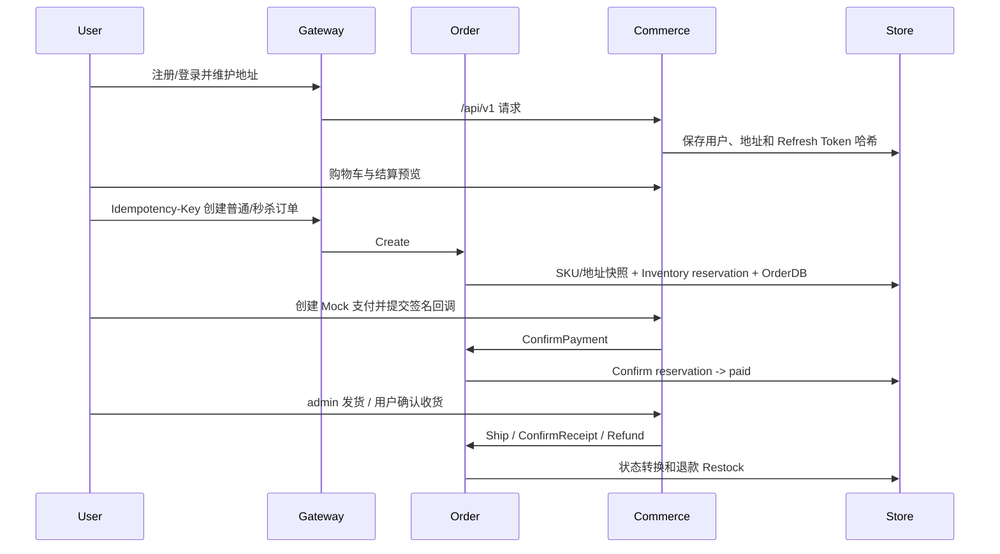

# 架构设计

## 总体架构

当前处于微服务迁移第 3 阶段：Catalog、Inventory/Seckill、Order 和 Identity 地址快照适配器已具备独立 gRPC 运行边界；新商城订单由 Order Service 唯一编排，Commerce API 仅保留支付、物流、退款和身份/购物车等过渡能力。

## 目标微服务架构

## 迁移阶段形态
- **第 3 阶段运行态:** Gateway 显式注册 `/api/v1/orders*` 和 `/api/v1/seckill/orders`，通过 Order gRPC 创建、查询和取消订单；其余未切换路由继续通过 `NoRoute` 兼容代理到 Commerce API。
- **Order 编排态:** Order 通过 Catalog 获取 SKU 快照、通过 Identity Snapshot 获取地址快照、通过 Inventory 一次完成普通预占或秒杀准入，并只写自己的订单表、状态历史、创建意图和操作记录。
- **库存状态态:** Inventory/Seckill 提供 `Reserve`、`Confirm`、`Release`、`Restock` 和 `AdmitSeckill`；`Release` 只处理支付前 reserved，`Restock` 只处理退款前已确认库存。MemoryStore 用于无 Docker Fake E2E，RedisStore 用 Lua 保证库存、限购和恢复原子性。
- **Commerce 过渡态:** `commerce-api` 在 `order_service` 模式下关闭订单创建和超时 worker；支付回调、发货、收货、退款先调用 Order 状态机，再记录自身的过渡数据。
- **契约基线:** `common/contracts` 只存放跨服务稳定事件信封、事件类型和服务标识；`proto/commerce` 存放新商城版本化 gRPC 契约。
- **目标边界:** Identity、Catalog、Inventory/Seckill、Cart、Order、Payment、Fulfillment 各自拥有数据和 Outbox/Inbox，禁止跨服务直接写表。
- **切换原则:** 每阶段先完成 Fake/契约测试，再由 Gateway 将对应 `/api/v1` 路由切换到目标服务。
- **边界契约:** `common/contracts` 固化七个业务服务的数据集、同步依赖和事件发布/消费关系；返回值为副本，避免调用方修改全局定义。
- **配置契约:** `config/commerce-services.example.yaml` 为目标服务提供独立监听地址、DSN、RabbitMQ URL 和 etcd 地址；通过 `SECKILL_SERVICES_CONFIG` 按角色加载，Gateway 不读取业务 DSN，Inventory 额外配置 Redis。
- **事件版本契约:** `EventType` 负责路由和主版本，`EventVersion` 负责 Payload/信封演进；传输层接受正数未来版本，消费者必须按能力处理未知版本。
- **服务入口:** `go run ./cmd/catalog-service`、`go run ./cmd/inventory-service`、`go run ./cmd/identity-snapshot-service` 和 `go run ./cmd/order-service` 可在无真实基础设施时使用 Memory/直连 Fake 验收；配置和环境变量支持切换到 MySQL、Redis 与 etcd。

## 商城核心流程

## 一致性与状态
- 创建订单通过同步 gRPC 编排下游，再在 Order Repository 本地事务提交订单、订单项、状态历史和创建意图；跨服务动作以确定性 ID 和操作记录补偿。
- 支付成功确认预占库存；待支付取消或超时调用 `Release`；已支付退款调用 `Restock` 恢复已确认库存。
- 订单和支付重复请求分别由 `(user_id, idempotency_key)`、`callback_ref` 和状态机保证幂等。
- Commerce Outbox 已持久化版本化事件，Inbox 表已建模；第一阶段已补充跨服务事件信封、事件类型和数据所有权，发布器和领域消费者仍待后续阶段接入。

## 已知边界
- 当前环境未完成真实 MySQL migration 重放和完整 Compose 健康检查，已用内存 E2E、SQL 解析和 Compose 配置校验替代。
- 新链路 `/api/v1/seckill/orders` 进入 Order Service，并只调用一次 Inventory `AdmitSeckill`；旧 `/order` 仍保留原 Redis/MQ 兼容链路。
- 订单创建意图恢复和库存操作都有最大 8 次重试；达到上限后保持可查询失败状态，不无限轰炸下游。
- 旧 MQ Consumer 仍跨写旧 `orders` 与 `product` 表；该行为被限制在兼容域，不属于新商城数据所有权模型。
- 前端明确暂缓，OpenAPI 是当前客户端契约。
- Identity 当前是最小地址快照适配器；Cart、Payment、Fulfillment 仍由 Commerce 过渡承载，不能误认为全部领域服务已经拆分完成。

## 重大架构决策

完整 ADR 存储在已归档方案的 `how.md` 中。

| adr_id | title | date | status | affected_modules | details |
|--------|-------|------|--------|------------------|---------|
| ADR-001 | 采用增量式受控微服务 | 2026-08-05 | ✅已采纳 | Gateway、Commerce、Legacy Services | [详情](../history/2026-08/202608051526_backend_commerce_mvp/how.md#adr-001-采用增量式受控微服务) |
| ADR-002 | 同一 MySQL 实例内实施领域数据所有权 | 2026-08-05 | ✅已采纳 | Commerce、Product、Order | [详情](../history/2026-08/202608051526_backend_commerce_mvp/how.md#adr-002-同一-mysql-实例内实施领域数据所有权) |
| ADR-003 | 金额使用最小货币单位整数 | 2026-08-05 | ✅已采纳 | Commerce API、Trade | [详情](../history/2026-08/202608051526_backend_commerce_mvp/how.md#adr-003-金额使用最小货币单位整数) |
| ADR-004 | 本地事务加 Outbox/Inbox | 2026-08-05 | ✅已采纳 | Commerce、Messaging | [详情](../history/2026-08/202608051526_backend_commerce_mvp/how.md#adr-004-本地事务加-outboxinbox) |
| ADR-005 | 采用渐进式微服务拆分 | 2026-08-06 | ✅已采纳 | Gateway、Commerce、Catalog、Inventory、Order、Messaging | [详情](../plan/202608060800_microservice_mall_migration/how.md#adr-001-采用渐进式微服务拆分) |
| ADR-006 | 订单状态只由 Order Service 维护 | 2026-08-06 | ✅已采纳 | Order、Inventory、Payment、Fulfillment | [详情](../plan/202608060800_microservice_mall_migration/how.md#adr-002-订单状态只由-order-service-维护) |
| ADR-007 | 服务数据库按所有权隔离 | 2026-08-06 | ✅已采纳 | All Services、Platform | [详情](../plan/202608060800_microservice_mall_migration/how.md#adr-003-服务数据库按所有权隔离) |
| ADR-008 | 先切换 Catalog 查询，延后秒杀订单完整切换 | 2026-08-06 | ✅已采纳 | Gateway、Catalog、Inventory、Commerce | [详情](../history/2026-08/202608060842_catalog_inventory_services/how.md#adr-001-先切换-catalog-查询延后秒杀订单完整切换) |
| ADR-009 | EventType 与 EventVersion 独立演进 | 2026-08-06 | ✅已采纳 | Contracts、Messaging、Catalog、Inventory | [详情](../history/2026-08/202608061041_contract_config_hardening/how.md#adr-001-eventtype-与-eventversion-独立演进) |
| ADR-010 | 显式选择按服务配置并保留旧配置回退 | 2026-08-06 | ✅已采纳 | Platform、Gateway、Catalog、Inventory | [详情](../history/2026-08/202608061041_contract_config_hardening/how.md#adr-002-显式选择按服务配置保留旧配置回退) |
| ADR-011 | Order Service 成为商城订单唯一写入者 | 2026-08-06 | ✅已采纳 | Order、Gateway、Commerce | [详情](../history/2026-08/202608061112_order_service_orchestration/how.md#adr-011-order-service-成为商城订单唯一写入者) |
| ADR-012 | 使用同步 gRPC 编排加本地可重试操作记录 | 2026-08-06 | ✅已采纳 | Order、Inventory、Commerce | [详情](../history/2026-08/202608061112_order_service_orchestration/how.md#adr-012-使用同步-grpc-编排加本地可重试操作记录) |
| ADR-013 | Identity 使用地址快照 gRPC 兼容适配 | 2026-08-06 | ✅已采纳 | Identity、Order | [详情](../history/2026-08/202608061112_order_service_orchestration/how.md#adr-013-identity-使用地址快照-grpc-兼容适配) |
| ADR-014 | 秒杀只走一次 Inventory 预占并在预占时绑定订单 | 2026-08-06 | ✅已采纳 | Gateway、Order、Inventory | [详情](../history/2026-08/202608061112_order_service_orchestration/how.md#adr-014-秒杀只走一次-inventory-预占并在预占时绑定订单) |
| ADR-015 | 通过确定性创建意图处理跨服务重试 | 2026-08-06 | ✅已采纳 | Order、Inventory | [详情](../history/2026-08/202608061112_order_service_orchestration/how.md#adr-015-通过确定性创建意图处理跨服务重试) |
