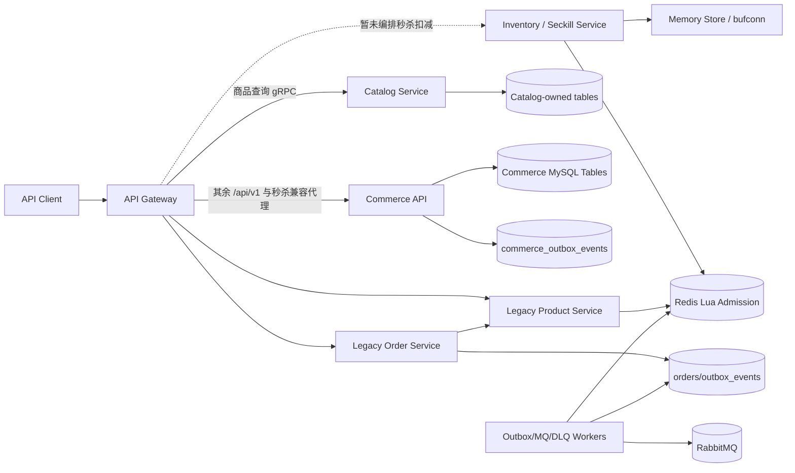
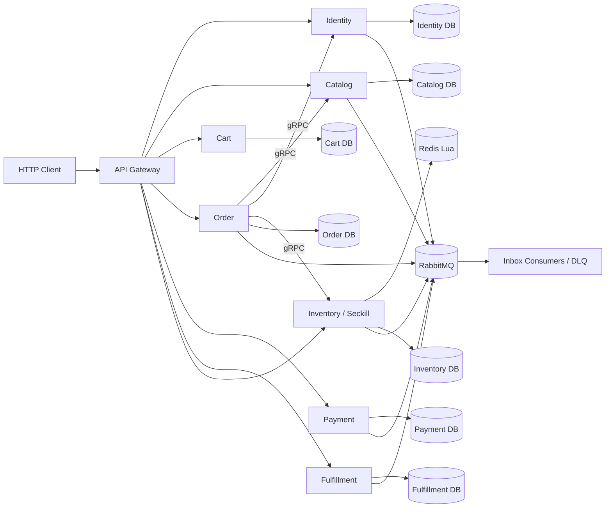
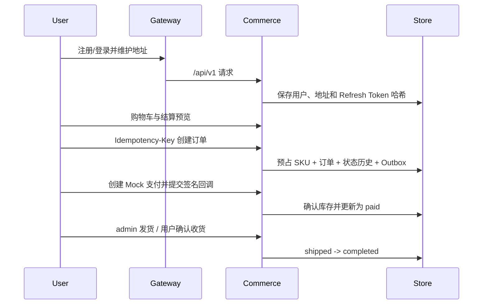

# 架构设计

## 总体架构

当前处于微服务迁移第 2 阶段：Catalog 已通过 Gateway 接管商品查询，Inventory/Seckill 已具备独立 gRPC 状态机；订单、身份、购物车、支付和履约仍由 `commerce-api` 过渡承载。

## 目标微服务架构

## 迁移阶段形态
- **第 2 阶段运行态:** Gateway 的 `GET /api/v1/products*` 通过 `etcd:///seckill/catalog` 调用 Catalog；未显式切换的 `/api/v1` 路由通过 `NoRoute` 兼容代理到 Commerce API。
- **独立库存态:** Inventory/Seckill 提供 `Reserve`、`Confirm`、`Release` 和 `AdmitSeckill`，MemoryStore 用于无 Docker Fake E2E，RedisStore 用 Lua 保证库存和活动限购原子性。
- **过渡运行态:** `commerce-api` 仍承载新商城本地事务；Product、Order 和消息 Worker 保持旧 gRPC、Redis Lua、RabbitMQ 链路。
- **契约基线:** `common/contracts` 只存放跨服务稳定事件信封、事件类型和服务标识；`proto/commerce` 存放新商城版本化 gRPC 契约。
- **目标边界:** Identity、Catalog、Inventory/Seckill、Cart、Order、Payment、Fulfillment 各自拥有数据和 Outbox/Inbox，禁止跨服务直接写表。
- **切换原则:** 每阶段先完成 Fake/契约测试，再由 Gateway 将对应 `/api/v1` 路由切换到目标服务。
- **边界契约:** `common/contracts` 固化七个业务服务的数据集、同步依赖和事件发布/消费关系；返回值为副本，避免调用方修改全局定义。
- **配置契约:** `config/commerce-services.example.yaml` 为目标服务预留独立监听地址、DSN、RabbitMQ URL 和 etcd 地址；Gateway 不配置业务 DSN，Inventory 额外配置 Redis。
- **服务入口:** `go run ./cmd/catalog-service` 和 `go run ./cmd/inventory-service` 可在无 MySQL/Redis 时分别使用 debug 内存实现启动；配置和环境变量支持切换到 MySQL、Redis 与 etcd。

## 商城核心流程

## 一致性与状态
- 创建订单、库存预占、状态历史和 Outbox 在同一 MySQL 事务提交。
- 支付成功确认预占库存；待支付取消或超时释放库存；已支付未发货退款恢复库存。
- 订单和支付重复请求分别由 `(user_id, idempotency_key)`、`callback_ref` 和状态机保证幂等。
- Commerce Outbox 已持久化版本化事件，Inbox 表已建模；第一阶段已补充跨服务事件信封、事件类型和数据所有权，发布器和领域消费者仍待后续阶段接入。

## 已知边界
- 当前环境未完成真实 MySQL migration 重放和完整 Compose 健康检查，已用内存 E2E、SQL 解析和 Compose 配置校验替代。
- `/api/v1/seckill/orders` 进入统一商城状态机并使用 MySQL 条件库存预占，但尚未复用旧 Redis Lua 准入与旧 MQ 消费链路。
- `/api/v1/seckill/orders` 本阶段仍由 Commerce 兼容代理处理，Gateway 不会先调用 Inventory 再调用 Commerce，避免双重扣减；待 Order Service 阶段统一编排后再切换。
- 旧 MQ Consumer 仍跨写旧 `orders` 与 `product` 表；该行为被限制在兼容域，不属于新商城数据所有权模型。
- 前端明确暂缓，OpenAPI 是当前客户端契约。
- Catalog/Inventory 目标服务已完成第一批运行时实现；Identity、Cart、Order、Payment、Fulfillment 仍只有契约或过渡实现，不能误认为全部拆分完成。

## 重大架构决策

完整 ADR 存储在已归档方案的 `how.md` 中。

| adr_id | title | date | status | affected_modules | details |
|--------|-------|------|--------|------------------|---------|
| ADR-001 | 采用增量式受控微服务 | 2026-08-05 | ✅已采纳 | Gateway、Commerce、Legacy Services | [详情](../history/2026-08/202608051526_backend_commerce_mvp/how.md#adr-001-采用增量式受控微服务) |
| ADR-002 | 同一 MySQL 实例内实施领域数据所有权 | 2026-08-05 | ✅已采纳 | Commerce、Product、Order | [详情](../history/2026-08/202608051526_backend_commerce_mvp/how.md#adr-002-同一-mysql-实例内实施领域数据所有权) |
| ADR-003 | 金额使用最小货币单位整数 | 2026-08-05 | ✅已采纳 | Commerce API、Trade | [详情](../history/2026-08/202608051526_backend_commerce_mvp/how.md#adr-003-金额使用最小货币单位整数) |
| ADR-004 | 本地事务加 Outbox/Inbox | 2026-08-05 | ✅已采纳 | Commerce、Messaging | [详情](../history/2026-08/202608051526_backend_commerce_mvp/how.md#adr-004-本地事务加-outboxinbox) |
| ADR-005 | 采用渐进式微服务拆分 | 2026-08-06 | ✅已采纳 | Gateway、Commerce、Catalog、Inventory、Order、Messaging | [详情](../plan/202608060800_microservice_mall_migration/how.md#adr-001-采用渐进式微服务拆分) |
| ADR-006 | 订单状态只由 Order Service 维护 | 2026-08-06 | ✅已采纳 | Order、Inventory、Payment、Fulfillment | [详情](../plan/202608060800_microservice_mall_migration/how.md#adr-002-订单状态只由-order-service-维护) |
| ADR-007 | 服务数据库按所有权隔离 | 2026-08-06 | ✅已采纳 | All Services、Platform | [详情](../plan/202608060800_microservice_mall_migration/how.md#adr-003-服务数据库按所有权隔离) |
| ADR-008 | 先切换 Catalog 查询，延后秒杀订单完整切换 | 2026-08-06 | ✅已采纳 | Gateway、Catalog、Inventory、Commerce | [详情](../history/2026-08/202608060842_catalog_inventory_services/how.md#adr-001-先切换-catalog-查询延后秒杀订单完整切换) |
