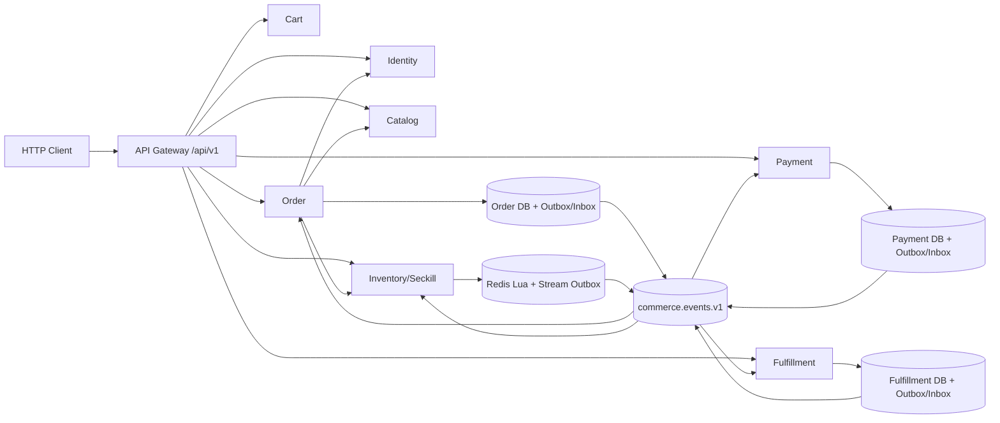

# 架构设计

## 总体架构

## 运行边界
- Gateway 只建立目标服务 gRPC 客户端，显式注册 `/api/v1` 路由；未注册路径返回 404。
- Gateway 实现位于 `services/gateway/internal`，只通过 `shared/gen/commerce`、`shared/contracts` 和 `shared/platform/internalcall` 调用领域服务，不引用其他服务实现包。
- Order、Payment、Fulfillment 的领域状态和事件写入各自数据库事务；Inventory 状态和 Stream Outbox 在同一 Redis Lua 脚本中完成。
- RabbitMQ 由服务自身发布和消费，不存在集中旧 Worker；服务队列、retry 和 DLQ 按消费者隔离。
- 旧服务代码、旧 HTTP 入口和旧消息 Worker 已从构建/Compose 移除；旧数据库表不删除，仅停止读写。

## 仓库布局

- `services/<service>/cmd` 保存服务进程入口和运行时组装。
- `services/<service>/internal` 保存该服务私有的领域模型、Repository、服务实现和单元测试，Go 编译器阻止跨服务导入。
- `services/<service>/etc` 保存服务本地配置；可选 `testkit` 仅向跨服务内存 E2E 暴露最小组装门面。
- `shared/contracts`、`shared/proto` 和 `shared/gen` 保存显式跨服务协议；业务客户端适配器归属调用方服务的 `internal/app`，不进入共享层。
- `shared/platform` 保存配置、服务发现、内部认证、消息、迁移和可观测性能力，且不得反向依赖 `services`。
- `tools` 保存仓库级工具；当前所有服务和工具共享根级 `go.mod`。
- `migrations` 保持全局版本文件名稳定，因为文件名是 `schema_migrations.version` 的持久标识。

## 事件路由

| 事件 | 发布者 | 消费者 |
|------|--------|--------|
| `seckill.accepted.v1` | Inventory | Order |
| `order.created.v1` | Order | Payment |
| `order.cancelled.v1` | Order | Payment、Inventory |
| `payment.succeeded.v1` | Payment | Order、Fulfillment |
| `payment.refunded.v1` | Payment | Order、Inventory |
| `inventory.reserved.v1` | Inventory | Order |
| `inventory.released.v1` | Inventory | Order |
| `inventory.restocked.v1` | Inventory | Order |
| `shipment.created.v1` | Fulfillment | Order |
| `shipment.delivered.v1` | Fulfillment | Order |

## 可靠性
- Outbox Publisher 使用持久消息、Publisher Confirm、mandatory return、批量 claim 和退避。
- Consumer 使用手动 Ack；业务处理成功且 Inbox 标记 processed 后才 Ack。
- 未知事件和未来版本安全隔离；可恢复错误进入 retry，超过上限进入 DLQ。
- 业务状态机与确定性 ID 共同保证同步 gRPC 与异步事件重复执行不产生重复事实。

## 重大架构决策

| ADR | 决策 | 日期 | 状态 |
|-----|------|------|------|
| ADR-001 | 统一新商城为唯一运行时，旧入口返回 404 | 2026-08-06 | ✅采纳 |
| ADR-002 | 按服务保存 Outbox/Inbox，Inventory 使用 Redis Stream | 2026-08-06 | ✅采纳 |
| ADR-003 | 旧表只停用不删除 | 2026-08-06 | ✅采纳 |
| ADR-004 | 统一入口、服务实现、契约与平台层目录 | 2026-08-07 | ✅采纳 |
| ADR-005 | 采用服务优先单仓库并保留单 Go module | 2026-08-07 | ✅采纳 |
| ADR-006 | Order 客户端适配器归属消费者服务 | 2026-08-07 | ✅采纳 |
| ADR-007 | Inventory 幂等命中须校验 reservation 状态，非 `reserved` 返回冲突 | 2026-08-09 | ✅采纳 |
| ADR-008 | Redis Inbox 失败语义对齐 SQL Inbox：attempts 持久化，5 次进 DLQ | 2026-08-09 | ✅采纳 |

目录分层设计见 [ADR-004](../history/2026-08/202608070731_repository_layout_refactor/how.md#adr-004-统一单仓库服务目录与平台层)；服务优先设计见 [ADR-005](../history/2026-08/202608070804_service_first_monorepo/how.md#adr-005-采用服务优先单仓库并保留单-go-module)；客户端边界见 [ADR-006](../history/2026-08/202608070836_private_order_clients/how.md#adr-006-order-客户端适配器归属消费者服务)。
库存幂等状态校验见 [ADR-007](../history/2026-08/202608091438_fix_core_bugs/how.md#三bug2-已释放-reservation-拒绝幂等复用)；Redis Inbox 失败语义见 [ADR-008](../history/2026-08/202608091438_fix_core_bugs/how.md#四bug3-消息重试计数与忙循环)。
